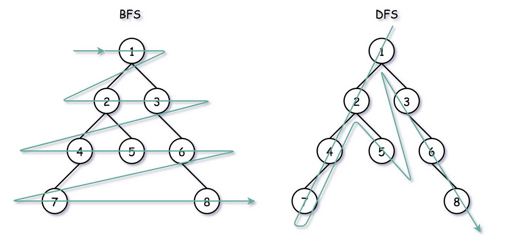

# Breadth-First Search

We now consider the following revised version of the climbing stairs problem.

!!! question "Climbing stairs with minimum moves"

    You are climbing a staircase with `n` steps. At each step, you can climb any number of steps from a given list `steps` (e.g., `[1, 3, 5]`). Find the minimum number of moves required to reach the top.

Instead of finding all possible paths to climb $n$ steps, we now want to find the minimum number of moves to reach the top. This is the <u>shortest path problem</u>, which can be solved more efficiently using **breadth-first search**.



As shown in the figure above, breadth-first search explores all nodes at the present depth level before moving on to nodes at the next depth level. This <u>level-order traversal</u> ensures that the first time we reach the target node, we have found the shortest path. In contrast, depth-first search explores nodes in a single direction, which may lead to longer paths.

## Implementation

Breadth-first traversal is usually implemented with the help of a "queue". The queue follows the "first in, first out" rule, while breadth-first traversal follows the "layer-by-layer progression" rule, the underlying ideas of the two are consistent. The generic idea to implement breadth-first search is as follows:

```python
from collections import deque

def bfs_template(problem, start_state):
    # Initialize queue
    result = []
    queue = deque([(start_state, result)]) 
    # Initialize visited set
    visited = []
    while queue:
        # Get the current state
        current_state, current_result = queue.popleft() 

        # Check if current state is the goal
        if is_solution(current_state):
            return current_result

        # Explore next possible states
        for next_state in generate_choices(current_state,problem):
            if is_valid(next_state,problem):
                if next_state in visited:
                    continue # Memoization
                visited.append(next_state)
                # Compute new result based on current result and next state
                next_result = compute_result(current_result, next_state)
                queue.append((next_state, next_result))
    return None # No goal state found
```


We now apply this template to solve the minimum moves to climb stairs problem.

```python
from collections import deque

def min_moves_to_climb(n, steps):
    # BFS Initialization
    queue = deque([(0, 0)])  # (current position, number of moves)
    visited = []  # To avoid revisiting the same step

    while queue:
        position, moves = queue.popleft()
        
        # If we reach the top, return the number of moves
        if position == n:
            return moves
        
        # Explore all possible moves
        for step in steps:
            next_position = position + step
            if next_position <= n and next_position not in visited:
                visited.append(next_position)
                queue.append((next_position, moves + 1))

    return -1  # If reaching the top is not possible
```

## Complexity analysis

Let $n$ be the number of all possible states.
- Time complexity is $O(n)$: All nodes are visited once, taking $O(n)$ time.
- Space complexity is $O(n)$: In the worst case, i.e., a full binary tree, before traversing to the bottom level, the queue can contain at most $O(n)$ nodes simultaneously, occupying space.
