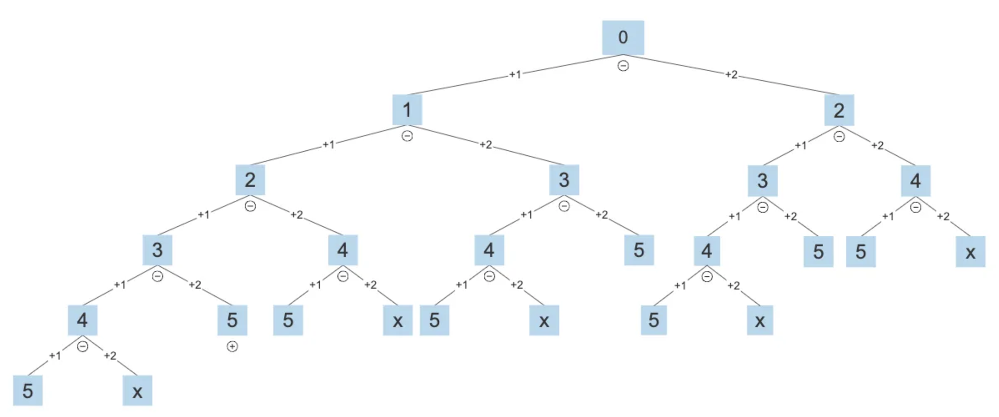

# Climbing Stairs Problem

There are many beautiful ideas in algorithms. We plan to use a classic problem to demonstrate them and show how to optimize the code using different ideas.

!!! question "Climbing stairs"

    Given a staircase with $n$steps, where you can climb $1$or $2$steps at a time, how many different ways are there to reach the top?

As shown in the figure below, there are $3$ ways to reach the top of a $3$-step staircase.


## Depth-first search

Let us start with the most straightforward approach: brute force search all the possible ways to climb the stairs. We will introduce the strategy called "backtracking".

<u>Backtracking</u> is a method to solve problems by exhaustive search, where the core idea is to start from an initial state and brute force all possible solutions, recording the correct ones until a solution is found or all possible choices are exhausted without finding a solution.
Backtracking typically employs "depth-first search" to traverse the solution space.

### Backtracking

We can describe the general backtracking algorithm framework with the following three components:

- `problem`: Represents the problem to be solved. The variable could pass any specific input parameters, constraints, etc.
- `state`: Represents the current state of the problem. The variable keeps track of the current partial solution.
- `choices`: Represents the choices available under the current state.
- `result`: Use this variable to store all valid solutions.

The main framework of backtracking is three major steps: **"pruning, trying, and retreating"**. Given the current state and we need to make the next choice, we need to:

- **Pruning**: Eliminate invalid choices.
- **Trying**: Attempt to make a choice.
- **Retreating**: If the choice is invalid, backtrack to the previous state.

Here is the backtracking algorithm framework:

```python
def backtrack(problem, state, choices, result):
    """
    A generic DFS template for backtracking problems.
    """
    # Check if the current state is a complete solution
    if is_solution(state, problem):
        result.append(state[:])  # Append a copy of the solution
        return
    
    # Iterate through all possible choices
    for choice in generate_choices(state, problem):
        if is_valid(choice, state, problem):  # Pruning:Check if the choice is valid
            state.append(choice)  # Trying
            backtrack(problem, state, choices, result)  # Explore further with this choice
            state.pop()  # Retreating: Undo the choice
```

Now we use the climbing stairs problem to demonstrate the backtracking algorithm.
The goal of this problem is to determine the number of ways. Imagine climbing stairs as a multi-round choice process: starting from the ground, choosing to go up $1$ or $2$ steps at a time.



```python
def backtrack(n: int, state: int, choices: list[int], path: list[int], result: list[list[int]]) -> None:
    """Backtracking to find all possible paths"""
    # is_solution: Reached the nth step
    if state == n: 
        result.append(path[:]) 
        return

    # Iterate through all possible choices
    for choice in choices:
        # Pruning: do not allow climbing beyond the nth step
        if state + choice <= n: # is_valid
            path.append(choice) # Trying
            backtrack(n, state + choice, choices, path, result) 
            path.pop() # Retreating

def climbing_stairs_paths(n: int) -> int:
    choices = [1, 2]  # Can choose to climb up 1 step or 2 steps
    state = 0  # Start climbing from the 0th step
    res = []  # To store all valid paths
    backtrack(n, state, choices, [], res)
    return len(res)
```

**Time Complexity**: $O(2^n)$
- Each step has $2$ choices (climb $1$ or $2$ steps), resulting in a complete recursion tree.
- The height of the recursion tree is $n$, so the total number of nodes (function calls) is $O(2^n)$.


**Space Complexity**: $O(2^n)$
- We need to store all the paths, which is $O(2^n)$ in the worst case. This is unnecessary if we only need the number of ways, but it is a good example to show the backtracking algorithm, and how it can output all the solutions.


## Recursive depth-first search

Backtracking algorithms treat solving the problem as a series of decision steps, searching for all possible solutions through exploration and pruning.

We can try to analyze this problem from the perspective of decomposition. Let $dp[i]$be the number of ways to reach the $i^{th}$step, then $dp[i]$is the original problem, and its subproblems include:

$$
dp[i-1], dp[i-2], \dots, dp[2], dp[1]
$$

Since each round can only advance $1$or $2$steps, when we stand on the $i^{th}$step, the previous round must have been either on the $i-1^{th}$or the $i-2^{th}$step. In other words, we can only step from the $i-1^{th}$or the $i-2^{th}$step to the $i^{th}$step.

This leads to an important conclusion: **the number of ways to reach the $i-1^{th}$step plus the number of ways to reach the $i-2^{th}$step equals the number of ways to reach the $i^{th}$step**. The formula is as follows:

$$
dp[i] = dp[i-1] + dp[i-2]
$$

This means that in the stair climbing problem, there is a recursive relationship between the subproblems, **the solution to the original problem can be constructed from the solutions to the subproblems**. The figure below shows this recursive relationship.


We can obtain the brute force search solution according to the recursive formula. Starting with $dp[n]$, **recursively decompose a larger problem into the sum of two smaller problems**, until reaching the smallest subproblems $dp[1]$and $dp[2]$where the solutions are known, with $dp[1] = 1$and $dp[2] = 2$, representing $1$and $2$ways to climb to the first and second steps, respectively.

The following code implements the <u>depth-first search</u>:

```python
def dfs(i: int) -> int:
    """Search"""
    # Known dp[1] and dp[2], return them
    if i == 1 or i == 2:
        return i
    # dp[i] = dp[i-1] + dp[i-2]
    count = dfs(i - 1) + dfs(i - 2)
    return count

def climbing_stairs_dfs(n: int) -> int:
    """Climbing stairs: Search"""
    return dfs(n)
```

The figure below shows the recursive tree formed by brute force search. For the problem $dp[n]$, the depth of its recursive tree is $n$, with a time complexity of $O(2^n)$. Exponential order represents explosive growth, and entering a long wait if a relatively large $n$is input.


Observing the figure above, **the exponential time complexity is caused by 'overlapping subproblems'**. For example, $dp[9]$is decomposed into $dp[8]$and $dp[7]$, $dp[8]$into $dp[7]$and $dp[6]$, both containing the subproblem $dp[7]$.

Thus, subproblems include even smaller overlapping subproblems, endlessly. A vast majority of computational resources are wasted on these overlapping subproblems. 

We have the following time and space complexity:

**Time Complexity**: $O(2^n)$

**Space Complexity**: $O(n)$


## Memoized search

To enhance algorithm efficiency, **we hope that all overlapping subproblems are calculated only once**. For this purpose, we declare an array `mem` to record the solution of each subproblem, and prune overlapping subproblems during the search process.

1. When $dp[i]$is calculated for the first time, we record it in `mem[i]` for later use.
2. When $dp[i]$needs to be calculated again, we can directly retrieve the result from `mem[i]`, thus avoiding redundant calculations of that subproblem.

The code is as follows:

```python
def dfs(i: int, mem: list[int]) -> int:
    """Memoized search"""
    # Known dp[1] and dp[2], return them
    if i == 1 or i == 2:
        return i
    # If there is a record for dp[i], return it
    if mem[i] != -1:
        return mem[i]
    # dp[i] = dp[i-1] + dp[i-2]
    count = dfs(i - 1, mem) + dfs(i - 2, mem)
    # Record dp[i]
    mem[i] = count
    return count

def climbing_stairs_dfs_mem(n: int) -> int:
    """Climbing stairs: Memoized search"""
    # mem[i] records the total number of solutions for climbing to the ith step, -1 means no record
    mem = [-1] * (n + 1)
    return dfs(n, mem)
```

Observe the figure below, **after memoization, all overlapping subproblems need to be calculated only once, optimizing the time complexity to $O(n)$**, which is a significant leap.


We have the following time and space complexity:

**Time Complexity**: $O(n)$

**Space Complexity**: $O(n)$

## Dynamic programming

**Memoized search is a 'top-down' method**: we start with the original problem (root node), recursively decompose larger subproblems into smaller ones until the solutions to the smallest known subproblems (leaf nodes) are reached. Subsequently, we collect the solutions of the subproblems, constructing the solution to the original problem.

On the contrary, **dynamic programming is a 'bottom-up' method**: starting with the solutions to the smallest subproblems, iteratively construct the solutions to larger subproblems until the original problem is solved.

Since dynamic programming does not include a backtracking process, it only requires looping iteration to implement, without needing recursion. In the following code, we initialize an array `dp` to store the solutions to the subproblems, serving the same recording function as the array `mem` in memoized search:

```python
def climbing_stairs_dp(n: int) -> int:
    """Climbing stairs: Dynamic programming"""
    if n == 1 or n == 2:
        return n
    # Initialize dp table, used to store subproblem solutions
    dp = [0] * (n + 1)
    # Initial state: preset the smallest subproblem solution
    dp[1], dp[2] = 1, 2
    # State transition: gradually solve larger subproblems from smaller ones
    for i in range(3, n + 1):
        dp[i] = dp[i - 1] + dp[i - 2]
    return dp[n]
```

The figure below simulates the execution process of the above code.


Dynamic programming uses the concept of "states" to represent specific stages in problem solving, each state corresponding to a subproblem and its local optimal solution. For example, the state of the climbing stairs problem is defined as the current step number $i$.

Based on the above content, we can summarize the commonly used terminology in dynamic programming.

- The array `dp` is referred to as the <u>DP table</u>, with $dp[i]$representing the solution to the subproblem corresponding to state $i$.
- The states corresponding to the smallest subproblems (steps $1$and $2$) are called <u>initial states</u>.
- The recursive formula $dp[i] = dp[i-1] + dp[i-2]$is called the <u>state transition equation</u>.


We have the following time and space complexity:

**Time Complexity**: $O(n)$

**Space Complexity**: $O(n)$

### Space optimization

Observant readers may have noticed that **since $dp[i]$is only related to $dp[i-1]$and $dp[i-2]$, we do not need to use an array `dp` to store the solutions to all subproblems**, but can simply use two variables to progress iteratively. The code is as follows:

```python
def climbing_stairs_dp_comp(n: int) -> int:
    """Climbing stairs: Space-optimized dynamic programming"""
    if n == 1 or n == 2:
        return n
    a, b = 1, 2
    for _ in range(3, n + 1):
        a, b = b, a + b
    return b
```

Observing the above code, since the space occupied by the array `dp` is eliminated, the space complexity is reduced from $O(n)$ to $O(1)$.


We have the following time and space complexity:

**Time Complexity**: $O(n)$

**Space Complexity**: $O(1)$

In dynamic programming problems, the current state is often only related to a limited number of previous states, allowing us to retain only the necessary states and save memory space by "dimension reduction". **This space optimization technique is known as 'rolling variable' or 'rolling array'**.


