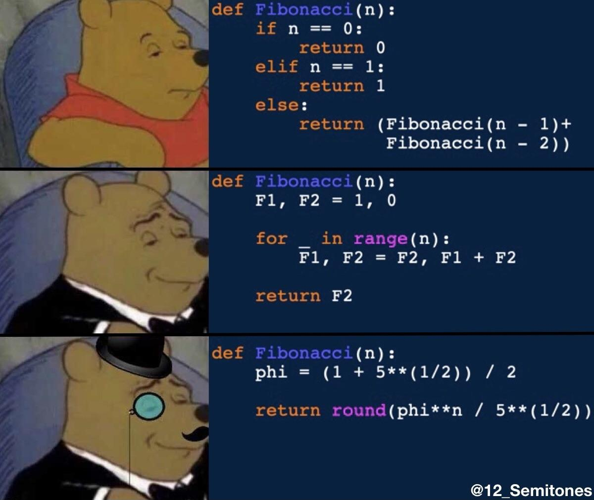

# Overview

This chapter delves into various algorithmic strategies and techniques, providing a comprehensive understanding of how to approach and solve complex problems efficiently. We explore fundamental concepts such as Depth-First Search (DFS), Divide and Conquer, Breadth-First Search (BFS), Dynamic Programming, and more. Each section is designed to build your knowledge progressively, with practical examples and visualizations to aid comprehension.

# Lectures

* [Depth-First Search](climb_stairs.md)
* [Divide and Conquer](divide_n_conquer.md)
* [Breadth-First Search](bfs.md)
* [Dynamic Programming](dynamic_programming.md)

