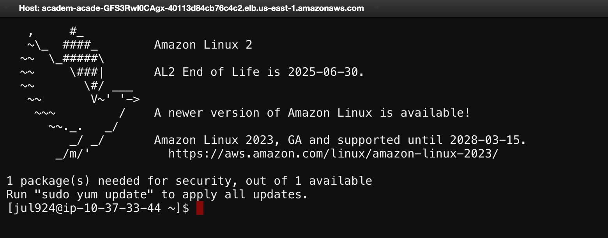
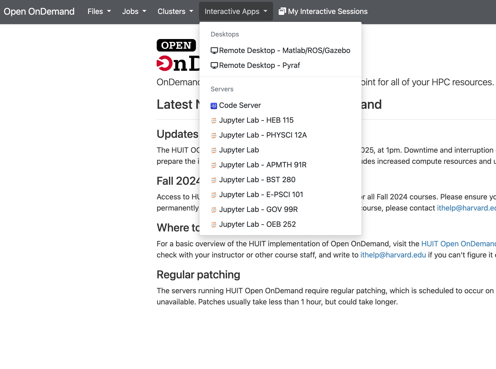
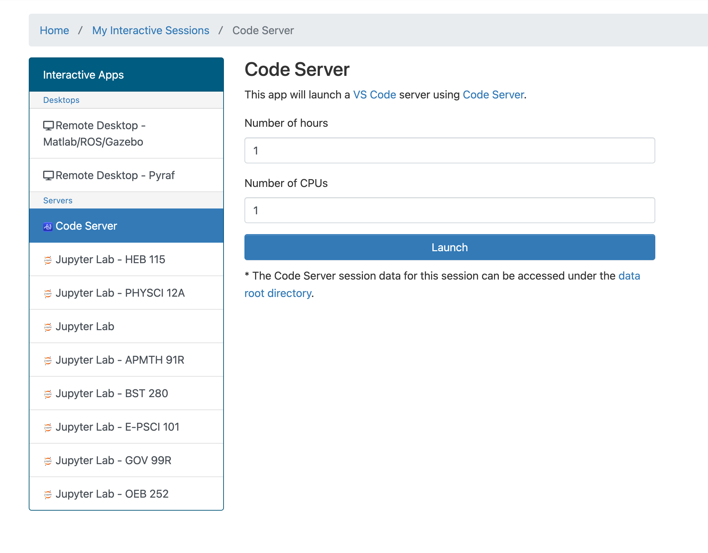
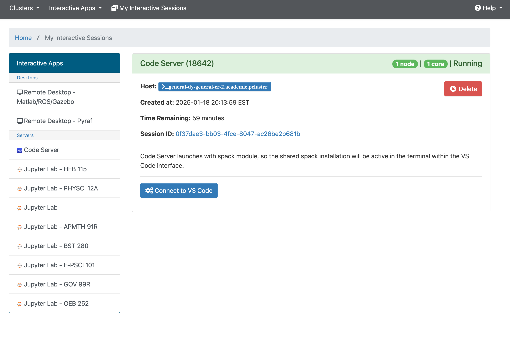
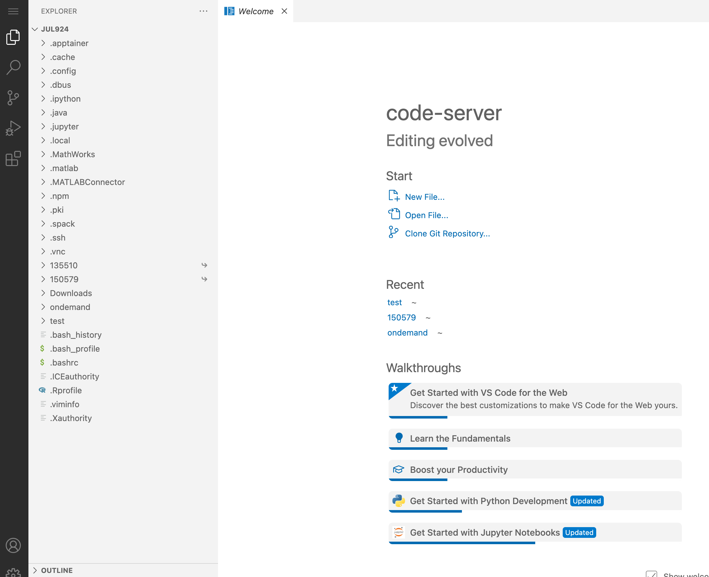

# Class Cluster

The cluster computing of the class is supported by Harvard Academic Technologies Group similar to the [FAS-RC cluster](https://rc.fas.harvard.edu/). The cluster can be accessed by logging in with your Harvard credentials [here](https://ood.huit.harvard.edu/). Please read over the [HUIT user guide](https://harvard-atg.github.io/huit-ondemand-user-docs/).

## Terminal Access 

To get started with the cluster, click "Clusters" and then "Academic shell access". This will open a terminal very similar to the one on your personal computer. 



Upon opening the terminal, you will be in your personal directory where you can store your files. Type `pwd` to get the path to this directory.  Your personal directory should be `~/shared/home/YOUR_USERNAME`.


## VS Code Access 

You can also use virtual VS Code on cluster by following the steps below.


=== "<1>"
    

=== "<2>"
    

=== "<3>"
    

=== "<4>"
    


## Getting started with SLURM

When you want to run code, please use [Slurm](https://slurm.schedmd.com/documentation.html) to submit jobs to a compute node. Avoid running computationally intensive code on the login node. The following is a simple demonstration on how to use Slurm to run a python script. 


**If you are using the Academic shell**

- Create a python file called `hello.py`
    - Run `nano hello.py` to open the text editor
    - Type `print("Hello world")`. 
    - Type `^X` to exit the text editor. 
- Typing `ls` prints a list of files in your current directory. `hello.py` should be included in the list. 
- Run `nano slurm_test.sh` and paste the following

```

#!/bin/bash
#SBATCH --job-name=example_job   # Name of the job
#SBATCH --output=slurm_%j.log    # Log file 
#SBATCH --error=slurm_%j.err     # Error file 
#SBATCH --time=24:00:00          # Time limit (24 hours)
#SBATCH --ntasks=1               # Number of tasks (default is 1)
#SBATCH --cpus-per-task=1        # Number of CPU cores per task
#SBATCH --mem=4G                 # Memory per node 


echo "Job started"
# Run your command or script here
python3 hello.py
# Print the end time
echo "Job ended"
```

- It is important not to overspecify amount of computation required (time limit, memory CPUs) because the cluster is shared with other users. For this class, please do not use a time limit greater than 24 hours. 

- To submit the job, run `sbatch slurm_test.sh`. You should see `Submitted batch job X` where `X` is the job number. 

- To check the status of your job, type `sacct`. You will see a list of all your submitted jobs and their status. 

- Once the job is `COMPLETED`, you can see the output by typing `slurm_X.log`, where `X` is the job number. 

- This workflow can be used as a template when submitting more complicated jobs, but feel free to modify it as needed. 

**If you are using VS Code**

- Create the `slurm_test.sh` file like above in VS Code.
- Press `Ctrl + ~` to open the terminal in VS Code.
- Type `sbatch slurm_test.sh` to submit the job.

!!! note "Tips"

   VS Code on the cluster cannot directly use Github Copilot. We suggest you code locally and use Github to synchronize your local and cluster code. 

