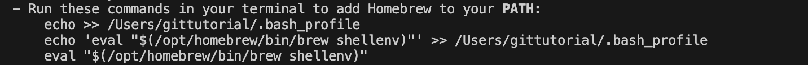

# Installation Guide Before Kick off

The instructions in this page will be for all two operating systems: macOS and Windows. 

For macOS, please use the terminal. For Window users, please use PowerShell (run as Administrator). From now on, by saying to run

```bash
the code
```

We mean by copying and pasting (or typing) the code into the terminal/Powershell and hit enter(return)


## Install language environments (You only need 1)

### Python

I suggest using pyenv to install python for better version management. The installation process varies by operating system:

#### For macOS:

1. We will use brew to install pyenv. First, let's check if you already have brew installed
```bash
brew--version
```
2. If you already have brew installed, jump to step 4. Other wise run
```bash
/bin/bash -c "$(curl -fsSL https://raw.githubusercontent.com/Homebrew/install/HEAD/install.sh)"
```
3. Brew will then gives instructions for you to run 3 lines in the terminal. Run it! Below is an example but my 3 lines will be different from yours

    
4. Now, you with brew, let install pyenv:
    ```bash
    brew install pyenv
    ```
5. Add pyenv to your shell configuration:
    - For bash, add to `~/.bashrc`:
    - For zsh, add to `~/.zshrc`:
    ```bash
    export PYENV_ROOT="$HOME/.pyenv"
    export PATH="$PYENV_ROOT/bin:$PATH"
    eval "$(pyenv init -)"
    ```

#### For Windows:

1. Install pyenv-win using PowerShell (run as Administrator):
    ```powershell
    Invoke-WebRequest -UseBasicParsing -Uri "https://raw.githubusercontent.com/pyenv-win/pyenv-win/master/pyenv-win/install-pyenv-win.ps1" -OutFile "./install-pyenv-win.ps1"; &"./install-pyenv-win.ps1"
    ```

2. Add System Environment Variables:
    - Open System Properties > Advanced > Environment Variables
    - Add to System Variables:
        - PYENV: `%USERPROFILE%\.pyenv\pyenv-win`
        - PYENV_HOME: `%USERPROFILE%\.pyenv\pyenv-win`
    - Add to Path:
        - `%USERPROFILE%\.pyenv\pyenv-win\bin`
        - `%USERPROFILE%\.pyenv\pyenv-win\shims`

Now with pyenve, we can install python for BOTH operating systems:

1. Install Python:
   ```bash
   pyenv install 3.10.0
   pyenv global 3.10.0
   ```
2. Verify the installation:
   ```bash
   python --version  # Should show Python 3.10.0
   ```

#### Check pip installation

Pip is Python's package installer. It usually comes with Python, but it's good to verify the installation:

1. Check if pip is installed:
```bash
pip --version
```
If pip is not installed or you need to upgrade it:

#### For macOS/Linux:
```bash
curl https://bootstrap.pypa.io/get-pip.py -o get-pip.py
python get-pip.py
```

#### For Windows:
```powershell
python -m ensurepip --upgrade
```

After installation, verify pip is working:
```bash
pip --version
```

#### Jupyter Notebook (Optional)

The installation process is the same for all operating systems:

1. Install Jupyter using pip:
   ```bash
   pip install notebook
   ```
2. Verify the installation:
   ```bash 
   jupyter notebook --version
   ```
3. Launch Jupyter Notebook:
   ```bash
   jupyter notebook
   ```

### R 

#### For macOS:
- Download and install R from [CRAN](https://cran.r-project.org/bin/macosx/)


#### For Windows:
- Download and install R from [CRAN](https://cran.r-project.org/bin/windows/base/)
- Download and install Rtools from [CRAN](https://cran.r-project.org/bin/windows/Rtools/)

## Install IDE

For your local Integrated Development Environment (IDE), We suggest using Visual Studio Code (VS Code) for Python and RStudio for R. 

### VS Code for Python

Head to the [VS Code official website](https://code.visualstudio.com/) to download and install the version that matches your operating system.

### RStudio for R

For RStudio, please head to [RStudio official website](https://posit.co/download/rstudio-desktop/) to download and install the version that matches your operating system.


