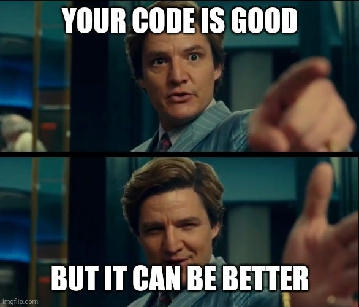

## Overview

Everyone here already knows how to code. This chapter is about the **best practices** for  **Readable coding**: making your code easier to read and maintain.

## Lectures

- [Code Principles](code_principle.md): Learn the foundational principles to pivot your coding mindset, including the importance of not repeating yourself and understanding code before relying on it.
- [Code Style](code_style.md): Discover the importance of coding style, including naming conventions, indentation, and the use of linting tools.

