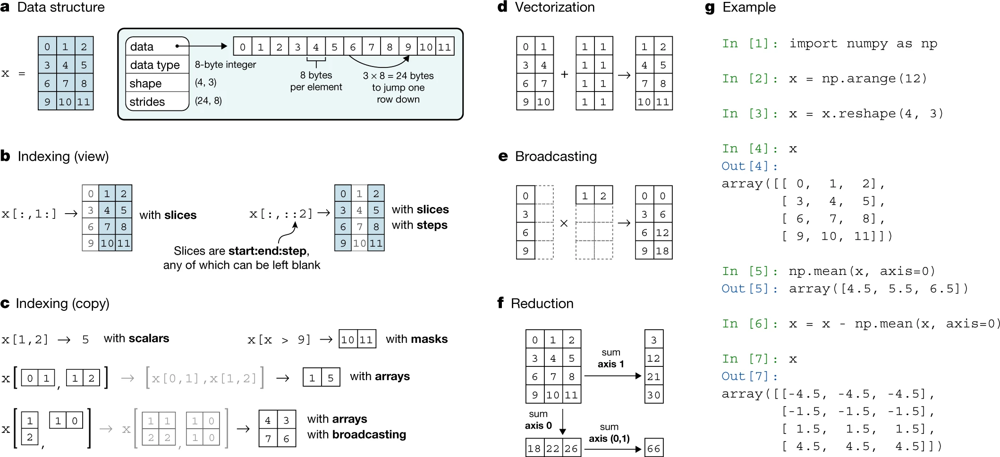

# NumPy Array 

NumPy is a powerful library for numerical computing in Python. It provides support for large, multi-dimensional arrays and matrices, as well as a wide range of mathematical functions. 

## Basic Operations



**Create and manipulate**: 

```python
import numpy as np

# Creating a basic NumPy array
np_array = np.array([1, 2, 3, 4, 5])

# Array Operations
squared_array = np_array ** 2  # Element-wise squaring
mean_value = np_array.mean()   # Calculate mean
```

**Insert**: Concatenate two arrays:

```python
# Insert at the end
np.concatenate([np_array, [10, 20]])
```

**Search**: The `where()` method returns the index of the first occurrence of a specified element:

```python
even_indices = np.where(np_array % 2 == 0)
# Find unique elements
unique_elements = np.unique(np_array)
# Boolean masking
mask = np_array > 3
filtered_arr = np_array[mask]
```

**Delete**: The `delete()` method removes an element from the array by its index:

```python
np.delete(np_array, [1, 2])
# Filtering Arrays
even_numbers = np_array[np_array % 2 == 0]
```

### Slicing

NumPy provides powerful slicing capabilities:

```python
# Create a sample array
sample_array = np.arange(10)

# Basic Slicing
first_three = sample_array[0:3]       # First 3 elements
last_three = sample_array[-3:]         # Last 3 elements
every_second = sample_array[::2]       # Every second element

# 2D Array Slicing
array_2d = np.array([[1, 2, 3], 
                     [4, 5, 6], 
                     [7, 8, 9]])

# Select first two rows
first_two_rows = array_2d[0:2, :]

# Select all rows, last two columns
last_two_columns = array_2d[:, 1:]
```

### Matrix Operations

```python
# Reshape and Column Operations
x = np.arange(12).reshape(3, 4)

# Calculate column means
column_means = np.mean(x, axis=0)

# Subtract column means
normalized_x = x - np.mean(x, axis=0)
```


## Key Performance Insights

**Use Lists for**:
  - General-purpose programming
  - Small datasets
  - Mixed data types

**Use NumPy Arrays for**:
  - Scientific computing
  - Vectorized operations
  - Large numerical computations


