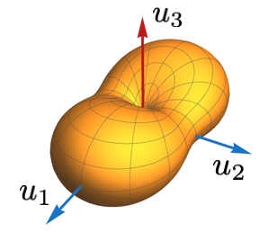
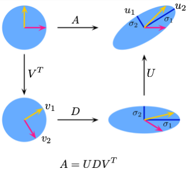

# Basics of Linear Algebra

Linearity is the simplest structure in mathematics. Let's review the basic notations and terminologies in linear algebra.

$A$ is an $m\times n$ real matrix, written $A\in\mathbb{R}^{m\times n}$, if 

$$ A = \begin{bmatrix} 
a_{1 1}  & a_{1 2} & \cdots & a_{1 n} \\
a_{2 1}  & a_{2 2} & \cdots & a_{2 n} \\
\vdots &         &        & \vdots \\
a_{m 1}  & a_{m 2} & \cdots & a_{m n} 
\end{bmatrix}$$

where $a_{i j}\in\mathbb{R}$. The $(i,j)$th entry of $A$ is $A_{i j} = a_{i j}$.

The *transpose* of $A\in\mathbb{R}^{m \times n}$ is defined as

$$ A^T = \begin{bmatrix}
A_{1 1}  & A_{2 1} & \cdots & A_{m 1} \\
A_{1 2}  & A_{2 2} & \cdots & A_{m 2} \\
\vdots &         &        & \vdots \\
A_{1 n}  & A_{2 n} & \cdots & A_{m n}
\end{bmatrix} \in \mathbb{R}^{n \times m}$$

In other words, $(A^T)_{i j} = A_{j i}$.

Note: $\mathbf{x}\in\mathbb{R}^n$ is considered to be a column vector in $\mathbb{R}^{n\times 1}$.

**Definition**(Sums and products of matrices). The sum of matrices $A \in \mathbb{R}^{m\times n}$ and $B \in \mathbb{R}^{m \times n}$ is the matrix $A + B\in \mathbb{R}^{m \times n}$ such that 

$$(A + B)_{i j} = A_{i j} + B_{i j}$$

The product of matrices $A \in \mathbb{R}^{m\times n}$ and $B \in \mathbb{R}^{n \times \ell}$ is the matrix $AB\in \mathbb{R}^{m \times \ell}$ such that

$$(A B)_{i j} = \sum_{k = 1}^n A_{i k} B_{k j}$$

The $n\times n$ *identity matrix*, denoted $I_{n}$ or $I$ for short, is

$$ I = I_{n} = \begin{bmatrix}
1  & 0 & \cdots & 0 \\
0  & 1 & \cdots & 0 \\
\vdots &         &        & \vdots \\
0  & 0 & \cdots & 1
\end{bmatrix} \in \mathbb{R}^{n \times n}$$

We have $I A = A = A I$.

If it exists, the *inverse* of $A$, denoted $A^{-1}$, is a matrix such that $A^{-1} A = I$ and $A A^{-1} = I$. If $A^{-1}$ exists, we say that $A$ is *invertible*. We have $(A^{-1})^T = (A^T)^{-1}$ and $(A B)^{-1} = B^{-1} A^{-1}$.

The *trace* of a square matrix $A \in \mathbb{R}^{n \times n}$, denoted $\text{tr}(A)$, is defined as $\text{tr}(A)= \sum_{i = 1}^n A_{i i}$. We have $\text{tr}(A B) = \text{tr}(B A)$ if $A B$ is a square matrix.

We say $A$ is *symmetric* if $A = A^T$.

The rank of a matrix $A$ is the dimension of $A$'s column space.

### Numpy Matrix Operations
Numpy has optimized the matrix operations based on the [BLAS](https://en.wikipedia.org/wiki/Basic_Linear_Algebra_Subprograms) and [LAPACK](https://en.wikipedia.org/wiki/LAPACK) libraries. So in python, for the most of the time, using Numpy to do matrix operations is faster than writing your own code.

```python
import numpy as np

A = np.array([[1, 2], [3, 4]])
B = np.array([[5, 6], [7, 8]])

# Identity matrix
I = np.eye(2)
# Matrix addition
C = A + B
# Matrix multiplication
D = A @ B
# Matrix entry-wise multiplication
E = A * B 
# Matrix transpose
F = A.T
# Matrix inverse
G = np.linalg.inv(A)
```

## Eigenvalues and Eigenvectors

Given two vectors $u, v \in \mathbb{R}^d$, the *inner product* is $\langle u, v \rangle := u^T v = \sum_{j=1}^d u_j v_j$. We define the $\ell_2$-norm of $u$ as $\|u\| = \sqrt{|\langle u, u \rangle|}$. The cosine of the angle between $u$ and $v$ is $\cos \alpha = \frac{\langle u, v \rangle}{\|u\|\|v\|}$. We say $u$ is orthogonal to $v$, denoted as $u \perp v$ if $\langle u, v \rangle=0$.


**Definition**(Eigenvalues and Eigenvectors). We say $\lambda$ and $v$ are the eigenvalue and eigenvector of a matrix $A$ if $A v= \lambda v$.

**Theorem**(Eigenvalue Decomposition). A symmetric matrix $A \in \mathbb{R}^{d\times d}$ has:

- Real eigenvalues: $\lambda_1 \ge \ldots \ge \lambda_d$
- Orthonormal eigenvectors: $u_1, \ldots, u_d$ such that $\|u_i\|=1$ and $u_i \perp u_j$ for all $1 \le i < j \le d$

such that we have the eigenvalue decomposition:

$$A = \sum_{i=1}^d \lambda_i u_i u_i^T$$

Denote $U = [u_1, \ldots, u_d] \in \mathbb{R}^{d \times d}$ and

$$\Lambda = \text{diag}(\lambda_1, \ldots, \lambda_d) := \begin{bmatrix}
\lambda_1  & 0 & \cdots & 0 \\
0  & \lambda_2 & \cdots & 0 \\
\vdots &         &        & \vdots \\
0  & 0 & \cdots & \lambda_d
\end{bmatrix}$$

The eigenvalue decomposition can also be written as $A = U\Lambda U^T$. We call $U$ an *orthogonal matrix* as $U^TU = I_d$.

As a cornerstone of our chapter, we prefer to interpret the concepts as a solution of an optimization problem. Such interpretation is usually called variational form. The following theorem gives a variational form of eigenvalues.


**Theorem**(Variational Form of Eigenvalues). Given a symmetric matrix $A$ same as above, its maximum eigenvalue has:

$$\lambda_{\max}(A) := \lambda_1 = \max_{\|x\| \le 1} x^T A x = \max_{x} \frac{x^T A x}{x^T x}$$

and $u_1 = \text{argmax}_{\|x\| \le 1} x^T A x$

and its minimum eigenvalue has:

$$\lambda_{\min}(A) := \lambda_d = \min_{\|x\| \le 1} x^T A x = \min_{x} \frac{x^T A x}{x^T x}$$

and $u_d = \text{argmin}_{\|x\| \le 1} x^T A x$



**Question:** What is the variational form of other eigenvalues? See the visualization in the figure above.

The concept of eigenvalue decomposition can be generalized to non-symmetric or even non-square matrices. We have the following theorem on singular value decomposition.


**Theorem**(Singular Value Decomposition). Given a rank $r$ matrix $A \in \mathbb{R}^{n \times d}$, there exist:

- Singular values: $\sigma_1 \ge \ldots \ge \sigma_r >0$ and denote $D = \text{diag}(\sigma_1, \ldots, \sigma_r)$
- Orthogonal matrices: $U = [u_1, \ldots, u_r] \in \mathbb{R}^{n \times r}$ and $V = [v_1, \ldots, v_r] \in \mathbb{R}^{d \times r}$ satisfying $U^T U = V^T V = I_r$

such that we have the singular value decomposition (SVD):

$$A = UDV^T = \sum_{i=1}^r \sigma_i u_i v_i^T$$

We can see that the eigenvalue decomposition is a special SVD. The matrix $A$ as a linear map transforms the two canonical unit vectors (yellow and red vectors) in the top left plot to the top right plot. This map can be decomposed into three steps:
1. $V^T$: rotating yellow and red vectors to $v_1$ and $v_2$
2. $D$: scaling the disc by $\sigma_1$ horizontally and $\sigma_2$ vertically
3. $U$: rotating two canonical unit vectors (blue lines) to $u_1$ and $u_2$



Given the concepts above, we can define the matrix operator norm.


**Definition**(Matrix Operator Norm). For a matrix $A \in \mathbb{R}^{n \times d}$, its operator norm (also called spectral norm) is defined as:

$$\|A\|_{2} = \max_{\|x\| \le 1} \|Ax\| = \max_{\|x\| \le 1} \sqrt{x^T A^T A x} = \sqrt{\lambda_{\max}(A^T A)} = \sigma_1$$

where $\sigma_1$ is the largest singular value of $A$. The operator norm measures the maximum "stretching factor" of the matrix when applied to any unit vector. Geometrically, it represents the semi-major axis of the ellipse that the unit ball is mapped to under the linear transformation $A$. In the following, we will simply use $\|A\|$ to denote the operator norm of $A$.
