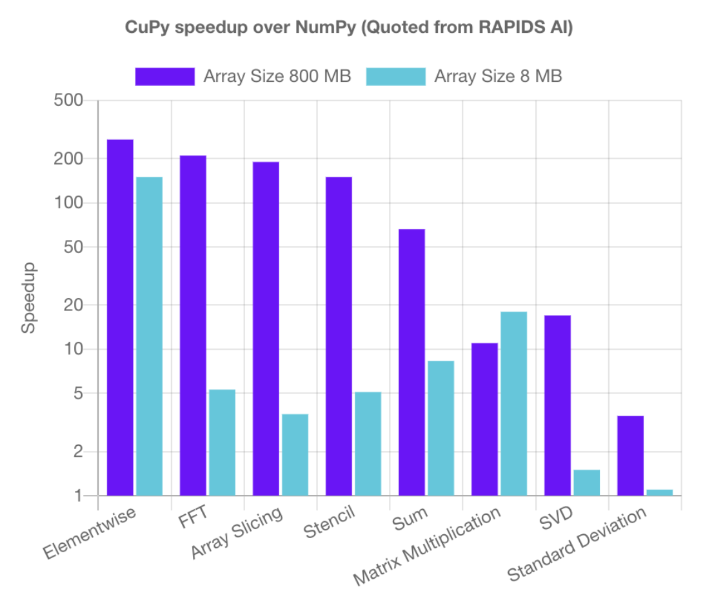

# GPU for Linear Algebra

Matrix computations are highly parallelizable operations that can greatly benefit from GPU acceleration. While CPUs are designed to handle sequential tasks with a few powerful cores, GPUs contain thousands of smaller cores optimized for parallel processing. When performing operations like matrix multiplication, where each element in the result can be computed independently, GPUs can distribute these calculations across their many cores to compute multiple elements simultaneously. This parallel processing capability makes GPUs particularly efficient for large-scale linear algebra operations, often achieving speedups of 10-100x compared to CPU implementations. Additionally, modern GPUs have high memory bandwidth, allowing them to quickly access and process large matrices.


## Set up GPU core in the Class Cluster

```bash
[jul924@ip-10-37-33-243 ~]$ salloc --partition=gpu --cpus-per-task=1 --mem=30G --time=01:00:00 srun --pty bash
salloc: Granted job allocation 38087
[jul924@gpu-dy-gpu-cr-7 ~]$ nvidia-smi
Mon Mar  3 19:16:23 2025       
+---------------------------------------------------------------------------------------+
| NVIDIA-SMI 535.216.01             Driver Version: 535.216.01   CUDA Version: 12.2     |
|-----------------------------------------+----------------------+----------------------+
| GPU  Name                 Persistence-M | Bus-Id        Disp.A | Volatile Uncorr. ECC |
| Fan  Temp   Perf          Pwr:Usage/Cap |         Memory-Usage | GPU-Util  Compute M. |
|                                         |                      |               MIG M. |
|=========================================+======================+======================|
|   0  NVIDIA L4                      On  | 00000000:31:00.0 Off |                    0 |
| N/A   28C    P8              16W /  72W |      0MiB / 23034MiB |      0%      Default |
|                                         |                      |                  N/A |
+-----------------------------------------+----------------------+----------------------+
                                                                                         
+---------------------------------------------------------------------------------------+
| Processes:                                                                            |
|  GPU   GI   CI        PID   Type   Process name                            GPU Memory |
|        ID   ID                                                             Usage      |
|=======================================================================================|
|  No running processes found                                                           |
+---------------------------------------------------------------------------------------+
```


## GPU Linear Algebra in Python

[CuPy](https://cupy.dev/) is a library that provides GPU acceleration for NumPy. It is a drop-in replacement for NumPy, but with GPU support. With the help of GPU, CuPy can accelerate the performance of linear algebra operations by 10-100x compared to CPU implementations as shown in the figure below.



For installation of CuPy, you can run the following command:

```bash
# Check if CuPy is installed
pip show cupy
# For CUDA 12.x
pip3 install cupy-cuda12x
```

It is super simple to use `cupy` in python: have your original NumPy code and replace the import with `import cupy as np`.

```python
# Import numpy as np
import cupy as np

# Create a random matrix
A = np.random.rand(1000, 1000)
B = np.random.rand(1000, 1000)

# Matrix multiplication
# Matrix multiplication using cupy
C = np.matmul(A, B)  # or C = A @ B

# Synchronize to ensure computation is complete
cp.cuda.stream.get_current_stream().synchronize()

# Create a random vector
b = np.random.rand(1000)

# Solve the linear system
x = np.linalg.solve(A, b)


```


