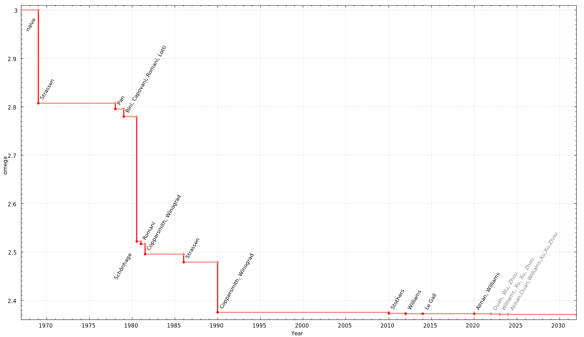

# Criteria of Numerical Algorithms

There are two major tasks in numerical linear algebra:

1. Solving linear systems
2. Computing eigenvalues and eigenvectors

As this course is an introductory course of general computation, we will not cover the details of algorithms solving these two problems. Instead, we will focus on the practical implementations. We suggest the readers to refer to the textbooks on numerical linear algebra for more details.

## Complexity of Matrix Operations

We discussed the two important standards for a good algorithm in the [Complexity Analysis](../chapter_computational_complexity/index.md):

- **Time complexity**: $A$ is $\ell$ by $m$ matrix, $B$ is $m$ by $n$ matrix, the time complexity of $AB$ is $O(\ell m n)$.
- **Space complexity**: Storage of $A$ and $B$ requires $O(\ell m + m n)$ space.

Actually, the time complexity of multiplying two $n$ by $n$ matrices can be faster than $O(n^3)$. Let $\omega$ be the exponent of the time complexity $O(n^\omega)$ of multiplying two $n$ by $n$ matrices. The naive range is $2 \le \omega \le 3$. It is still an open problem to find the minimum $\omega$. Till 2024, the best $\omega$ is 2.371339. We refer the readers to the [Wikipedia page](https://en.wikipedia.org/wiki/Computational_complexity_of_matrix_multiplication) for more details.

<!-- However, the real computation time is not only determined by the time complexity. In practice, even two algorithms with the same time complexity can have different running time. 
To understand why this situation occurs, we first need to understand the storage structure of modern computers. Modern computers use a multi-level storage system: registers, caches, main memory (RAM), disks, and tapes. When a computer directly exchanges information with registers, calculations occur by transferring the required data sequentially from higher-level to lower-level storage, starting from registers. Data at the end of the calculation process is then sequentially stored back into lower-level storage. As the storage level decreases (e.g., from registers to disks or tapes), the access speed to the data slows significantly. Generally, there are quantitative differences between these levels. Registers are extremely fast and efficient, while disks and tapes are relatively slow. Therefore, the capacity of disks and tapes is large, while the capacities of caches and registers are relatively small.
Based on this hierarchical storage structure of computers, when designing software, we should aim to minimize data transfers between external storage, registers, and main memory. 

To summarize, in modern computers, <u>computation is much faster than data communication</u>. Usually the bottleneck of your code is determined by the volume of data communication.
Suppose a particular computational task requires a total of $f$ operations and $m$ data retrievals; we define:

$$q = \frac{f}{m}$$

to represent the average number of computations performed per data retrieval. Our goal is to maximize $q$ to improve the efficiency of the computation.

The following table shows the ratio $q$ for some common matrix operations.

| Typical Operation | $f$ (Number of Computations) | $m$ (Number of Data Retrievals) | $q = f/m$ (Ratio) |
|------------------|------------------------------|--------------------------------|-------------------|
| $y \gets y + \alpha x$ | $2n$ | $3n + 1$ | $\frac{2}{3}$ |
| $y \gets y + Ax$ | $2n^2$ | $n^2 + 3n$ | $2$ |
| $C \gets C + AB$ | $2n^3$ | $4n^2$ | $\frac{n}{2}$ |

From the **table**, it is evident that the efficiency of matrix-matrix operations is the highest, with an average of computations per data retrieval. Therefore, in the design of matrix-related algorithms, we tend to maximize the use of matrix-matrix operations <u>when the computation complexity is same</u>.  For example, when multiplying matrices, numpy package (essentially BLAS and LAPACK libraries) has been optimized to conduct [block-wise matrix multiplication](https://www.netlib.org/lapack/lawnspdf/lawn107.pdf) considering a lot of hardware details and hundreds of experts have been working on the code optimization. This is why we should always use built-in functions to do matrix operations. 

We want to emphasize again that the above analysis only applies to when the computation complexities are same. In practice, we will consider the above suggestions using distributed algorithms. When you want to compute $ABx$ for the matrices $A, B$ and vector $x$, the complexity of $(AB)x$ is $O(n^3)$ while the complexity of $A(Bx)$ is $O(n^2)$. Therefore, we should compute $Bx$ first in this case. -->

## Sensitivity and Stability

Besides the time complexity and space complexity, we also need to consider the following two standards for numerical algorithms:

- **Sensitivity**: How much the numerical problem is affected by the small perturbations in the input data
- **Stability**: When running the algorithm, how do the roundoff (and other) errors affect the accuracy of the computed solution.

Notice that the sensitivity is fully determined by the problem itself and independent of the algorithm to solve it, while the stability is determined by the algorithm.

### Sensitivity Analysis

**Definition**(Sensitivity). We want to compute $f(x)$ for a given $x$. If $x$ is perturbed by $\delta x$, the output is $f(x + \delta x)$. Whyen $|\delta x|/|x|$ is small, we want to find a constant $c(x)$ as small as possible such that

$$
|f(x + \delta x) - f(x)| \le c(x) \frac{|\delta x|}{|x|}.
$$

We call $c(x)$ the **condition number** of the problem. We say the problem is **well-conditioned** if $c(x)$ is bounded, and **ill-conditioned** if $c(x)$ is large. 

We can see that when $f(x)$ is differentiable

$$
c(x) \approx \frac{|f'(x)||x|}{|f(x)|}.
$$

For complex problems, it is not easy to compute the condition number. 
We will discuss the condition number of linear algebra problems in the following sections.

### Backward Error Analysis

We all know that computers using the floating point arithmetic. 
For example, suppose the computer can only store 2 digits after the decimal point. When we compute $\pi + e$, the computer actually computes float$(\pi + e) = 3.14 + 2.72 = 5.86$ with a roundoff error $\epsilon \approx 0.00012$. Therefore, it is important to analyze how the roundoff errors affect the accuracy of algorithms. Even if a numerical problem is well-conditioned, a bad algorithm can still lead to a large error.

**Definition**(Backward Error Analysis). Suppose $\hat{f}$ is the algorithm to compute $f$. Suppose there exists a $\delta x$ such that 

$$
\hat{f}(x) = f(x + \delta x), \quad |\delta x| \le \epsilon |x|,
$$ 

where $\epsilon$ relates to the machine precision and the problem. We say the algorithm is **numerically stable** if $\epsilon$ is small.

Combining the sensitivity analysis and the backward error analysis, we can have the overall error bound of the result:

$$
\frac{|\hat{f}(x) - f(x)|}{|f(x)|} = \frac{|f(x + \delta x) - f(x)|}{|f(x)|} \le c(x) \frac{|\delta x|}{|x|} \le c(x) \epsilon.
$$

We can get a reliable result when we apply a numerically stable algorithm to a well-conditioned problem.

Here is a more concrete example of stable and unstable algorithms.

**Example.**(Stability of square root) 
Many algorithms compute $\sqrt{2}$ by starting with an initial approximation $x_0$ to $\sqrt{2}$, for instance $x_0 = 1.4$, and then computing improved guesses $x_1, x_2$, etc. 

One such method is the famous **Newton-Raphson method**. To solve $f(x) = 0$, we start with an initial guess $x_0$ and update it by:

$$ x_{k+1} = x_k - \frac{f(x_k)}{f'(x_k)}. $$

For $f(x) = x^2 - 2$, we have 

$$ x_{k+1} = \frac{x_k + \frac{2}{x_k}}{2} $$

Another method, called **"method X"**, is given by:

$$ x_{k+1} = (x_k^2 - 2)^2 + x_k, $$

where $\sqrt{2}$ is the fixed point.

A few iterations of each method are calculated in plots below, with initial guesses $x_0 = 1.4$ and $x_0 = 1.42$.

| Iteration | Newton (x₀=1.4) | Newton(x₀=1.42) | Method X (x₀=1.4) | Method X (x₀=1.42) |
|-----------|---------------------|---------------------|------------------|-------------------|
| x₀ | 1.4 | 1.42 | 1.4 | 1.42 |
| x₁ | 1.4142857... | 1.41422535... | 1.4016 | 1.42026896 |
| x₂ | 1.414213564... | 1.41421356242... | 1.4028614... | 1.42056... |
| ... | ... | ... | ... | ... |
| Final | x₁,₀₀₀,₀₀₀ = 1.41421... | - | x₂₇ = 7280.2284... | - |

You can see why the stability of two methods are different by the plot below.

**Tip**: Be careful with multiplication and division involving vastly different magnitudes. Be careful with subtraction of two nearly identical numbers (this is called catastrophic cancellation).

**Example.**(Catastrophic cancellation) The loss of significance can be demonstrated using the following two mathematically equivalent functions:

$$
f(x) = x\left(\sqrt{x+1} - \sqrt{x} \right), \quad
g(x) = \frac{x}{\sqrt{x+1} + \sqrt{x}}.
$$

Now, evaluating these functions at $x = 500$: The true value, computed with infinite precision, is $11.174755\ldots$. If a system is limited to storing only the four most significant decimal digits, we have

$$
f(500) = 500\left(\sqrt{501} - \sqrt{500}\right) = 500\left(22.38 - 22.36\right) = 500(0.02) = 10
$$

$$
g(500) = \frac{500}{\sqrt{501} + \sqrt{500}} = \frac{500}{22.38 + 22.36} = \frac{500}{44.74} = 11.17.
$$

Comparing the computed values, it is evident that loss of significance occurs. This is due to catastrophic cancellation when subtracting approximations of two nearly identical values, $\sqrt{501}$ and $\sqrt{500}$, even though the subtraction is performed exactly. 

