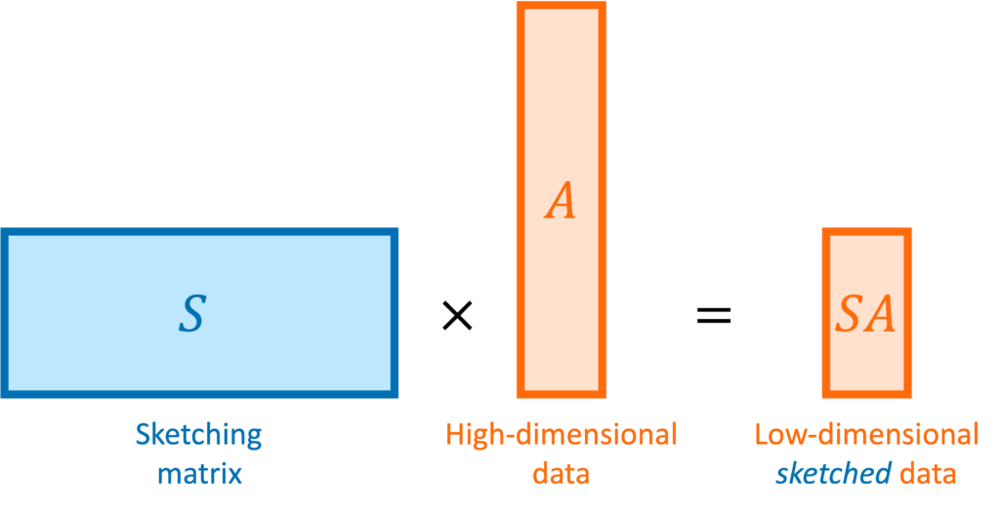
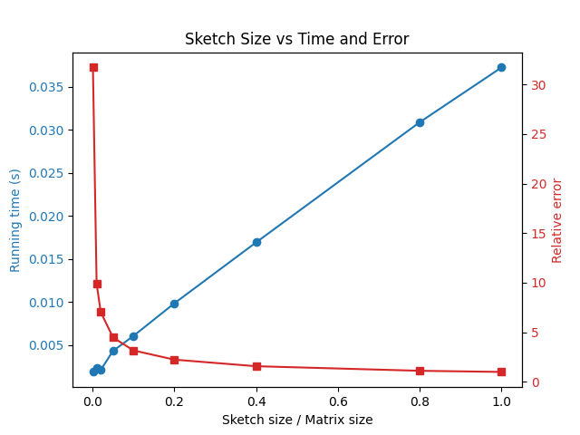
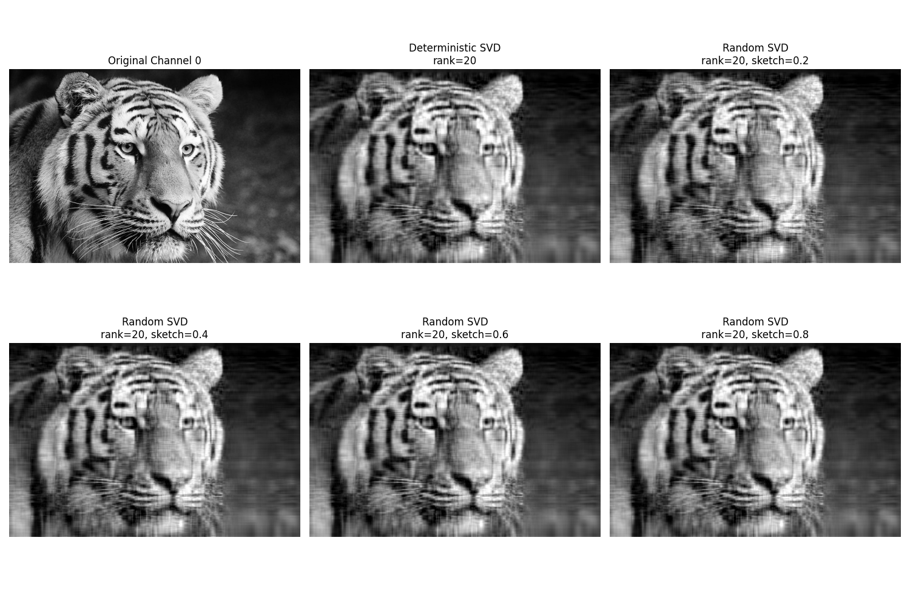

# Randomized Matrix Algorithms

## Sketching Matrix

You have an ultra-large matrix and you need to conduct linear algebra tasks for it, however, you only need an approximate solution in exchange for a faster computation. This is when randomized methods come in handy.

The high level idea of randomized methods is to use random sketching matrix $S$ to reduce the dimensionality of a large matrix $A$ to a smaller matrix $Y=AS$. 
We will illustrate the idea of randomized methods by the matrix multiplication and SVD. The sketching method cannot be directly applied to solve a linear system $Ax=b$ because the sketching matrix $S$ will change the size of the matrix. 



## Matrix Multiplication

In many applications the full matrix product
$$
C = AB,\quad \text{with } A\in\mathbb{R}^{m\times n} \text{ and } B\in\mathbb{R}^{n\times p},
$$
may be too costly to compute. We can instead compute an approximate product by "sketching" the inner dimension. The idea is to choose a random projection matrix $S\in\mathbb{R}^{n\times s}$ with $s\ll n$ and form:
$$
\tilde A = AS\quad \text{and}\quad \tilde B = S^T B.
$$
Then the approximate product is given by:
$$
\widetilde{C} = \tilde A \tilde B.
$$

The **key property** of the sketching matrix $S$ is that it should make the linear algebra operations work in **expectation**:
$$
\mathbb{E}[\widetilde{C}] = \mathbb{E}[\tilde A \tilde B] = \mathbb{E}[AS(S^T B)] = A(\mathbb{E}[SS^T]B) = AB,
$$
which means we need to design $S$ such that 
$$
SS^T \approx \mathbb{E}[SS^T] = I.
$$
For example, we can choose $S$ to be a Gaussian matrix with i.i.d. $\mathcal{N}(0,\frac{1}{s})$ entries. 

This is the key idea of randomized methods: even though the random matrix $SS^T$ is very low rank, it could be very close to the identity matrix. 

Below is a Python example code to illustrate the idea.

```python
import numpy as np
from numpy.linalg import norm

# Set dimensions: m x n times n x p
m, n, p = 500, 1000, 300

# Generate random matrices A and B
A = np.random.randn(m, n)
B = np.random.randn(n, p)

# Choose a sketch size s (s << n)
s = 100

# Create a random projection matrix S of size n x s (Gaussian random matrix)
S = np.random.randn(n, s) / np.sqrt(s)  # scaling to preserve norm in expectation

# Compute the sketched matrices
Y = A @ S      # Y has shape m x s
Z = S.T @ B    # Z has shape s x p

# Approximate product
C_approx = Y @ Z

# Compute the true product for comparison
C_true = A @ B

# Measure the relative error (Frobenius norm)
error = norm(C_true - C_approx, 'fro') / norm(C_true, 'fro')
print("Relative error in the approximate product:", error)
```

The figure below shows the trade-off between the running time and the error for choosing different sketch sizes for 1000 x 1000 matrix multiplication.


## Randomized SVD


Given a large matrix $A\in\mathbb{R}^{m\times n}$ with SVD $A = UD V^T$, we want to compute its left singular vectors $U$, which is also the eigenvectors of $A A^T$. Similar to the sketching idea above, we have
$$
 AS S^T A^T \approx  A A^T,
$$
therefore, the left singular vectors of $AS$ will be close to $U$. 

We formalize the idea of randomized SVD by the following steps:


- Step 1: Form a sketch $Y = AS$ where $S$ is a sketching matrix of size $n \times s$ (often $s \approx k + 10$ for $k$ desired eigenvalues).

- Step 2: QR decomposition of $Y = QR$ to get $Q \in \mathbb{R}^{n\times s}$. ($Q$ spans approximately the same subspace as $U$, i.e., there exists an orthogonal matrix $O \in \mathbb{R}^{s\times s}$ such that $Q \approx U O$)

- Step 3: Project $A$ into this lower-dimensional subspace: $B = Q^T A \in \mathbb{R}^{s\times n}$. ($B = Q^T U D V^T \approx O^T D V^T$)

- Step 4: Compute the SVD of the small matrix $B = \tilde{U}\Sigma\tilde{V}^T$. (As $B \approx O^T D V^T$, $\Sigma \approx D$ and $\tilde{V} \approx V$, we have $\tilde U \approx O^T \approx Q^T U$) 

The approximate left singular vectors of $A$ are given by $Q\tilde{U}$ and the right singular vectors are given by $\tilde{V}$ and the singular values are given by $\Sigma$. We can see that randomized SVD transfer a $m\times n$ matrix SVD to two $m\times s$ and $s\times n$ matrices SVDs.

```python
import numpy as np

def randomized_svd(A, rank):
    m, n = A.shape
    # Generate a random Gaussian matrix (Sketching size s = rank + 10)
    S = np.random.randn(n, rank+10)
    # Form the sample matrix Z, which is m x k
    Y = A @ S
    # Orthonormalize Y using QR decomposition
    Q, _ = np.linalg.qr(Y)
    # Obtain the low-rank approximation of A
    B = Q.T @ A
    # Perform SVD on the low-rank approximation
    U_tilde, Sigma, Vt = np.linalg.svd(B, full_matrices=False)
    # Obtain the final singular vectors
    U = Q @ U_tilde
    return U, Sigma, Vt
```

Below is an illustration of the recovery of the randomized SVD of a tiger image. The left is the original image and the right is the recovery by the randomized SVD with different sketching rates. 



<!--
## Randomized Method for Linear System

Sketching cannot be directly applied to solve a linear system $Ax=b$ because the sketching matrix $S$ will change the size of the matrix. 

We can use a randomized gradient descent method to solve the linear system. 

Solving the linear system $Ax=b$ is equivalent to solving the following least squares problem:
$$
\min_x \frac{1}{2n}\|Ax-b\|^2_2 = \min_x \frac{1}{2n} \sum_{i=1}^n (A_i x-b_i)^2,
$$
where $A_i$ is the $i$-th row of $A$.
The gradient descent method for the least squares problem is given by:

$$
x_{t+1} = x_t - \eta A^T(Ax_t-b),
$$
where $\eta$ is the step size. 

Instead of using the full gradient $\frac{1}{n}A^T(Ax-b) = \frac{1}{n}\sum_{i=1}^n (A_ix-b_i) A_i^T$, we can randomly sample one sample $i_t$ uniformly from $1$ to $n$ of the gradient:
$$
g_t = (A_{i_t}x-b_{i_t}) A_{i_t}^T
$$

Again we can check that the expectation of the gradient is the same as the full gradient:
$$
\mathbb{E}[g_t] = \mathbb{E}[(A_{i_t}x-b_{i_t}) A_{i_t}^T] = \frac{1}{n}\sum_{i=1}^n (A_ix-b_i)A_i^T = \frac{1}{n}A^T(Ax-b).
$$

This gives us the **Randomized Kaczmarz algorithm**:

$$
x_{t+1} = x_t -  \frac{(A_{i_t}x_t-b_{i_t})}{\|A_{i_t}\|^2} A_{i_t}^T,
$$
where we choose the step size $\eta = \frac{1}{\|A_{i_t}\|^2}$.


For ultra-large matrices, you may not be able to store the entire matrix by to read the each row of a matrix in every iteration. The Randomized Kaczmarz algorithm is a matrix-free method in the sense that it does not require storing the entire matrix. The following code use `scipy.sparse` to illustrate the idea.


## Randomized Method for Eigenvalue Problems


