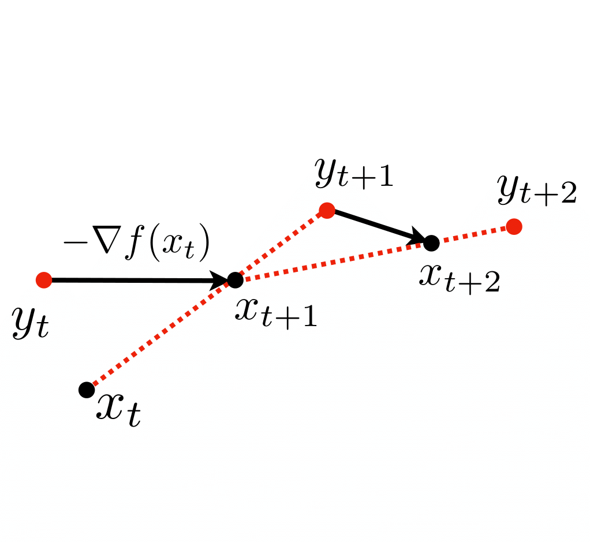
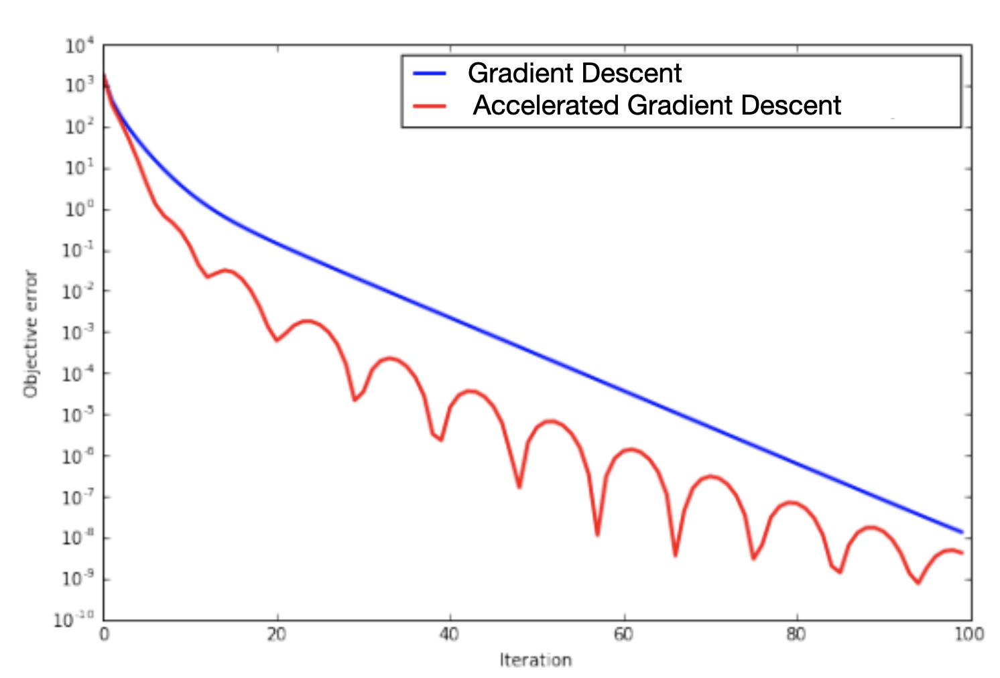

# Accelerated Gradient Descent

Looking at the trajectory of gradient descent, we notice it often follows a zigzag pattern. This happens because the steepest descent direction only uses local information about the objective function, making it shortsighted. Can we design an algorithm that converges faster?

We might consider these strategies to improve upon gradient descent:
- Use the history of the trajectory
- Add momentum for a smoother path

Instead of only using the local gradient at $x_t$, we can combine $-\nabla f(x_t)$ with information from previous points, like $x_t - x_{t-1}$. This creates a more stable direction with less zigzagging. Nesterov proposed the following accelerated gradient descent algorithm: This idea is also called "momentum", borrowed the intuition from the physics.

**Nesterov's Accelerated Gradient Descent (AGD)**: Initialize $x_0 = y_0$, then:

$$
\begin{align}
x_{t+1} &= y_t - \eta_t \nabla f(y_t)\\
y_{t+1} &= x_{t+1} + \frac{t}{t+3}(x_{t+1}- x_t)
\end{align}
$$

Unlike gradient descent, AGD uses the history of the trajectory through the $(x_{t+1}- x_t)$ term. Because it uses historical information, AGD's trajectory is not monotonically decreasing toward the minimum.

**Theorem** (Convergence of AGD): Let $f$ be convex and $L$-smooth. If we choose $\eta_t = 1/L$, then Nesterov's accelerated gradient descent achieves:

$$
f(x_t) - f(x^*) \leq \frac{2L\|x_0 - x^*\|_2^2}{(t+1)^2}
$$

This means AGD has a convergence rate of $O(1/t^2)$, which is faster than gradient descent's $O(1/t)$ rate. In other words, for convex and smooth functions, AGD can achieve $\epsilon$-accuracy within $O(1/\sqrt{\epsilon})$ steps. 

