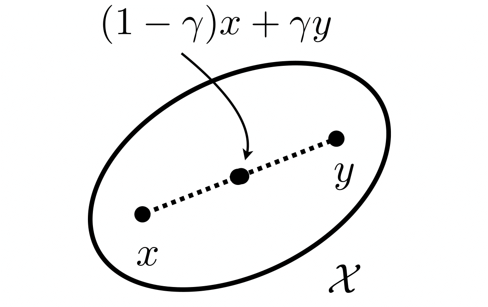
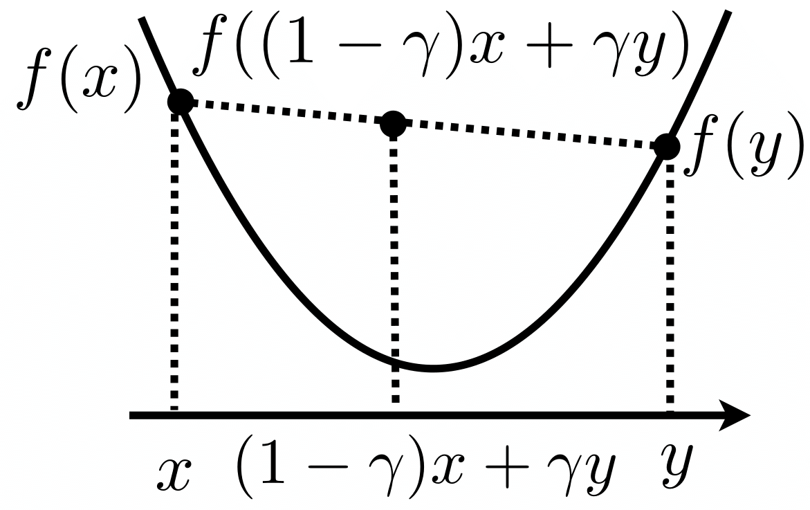
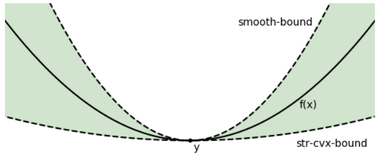
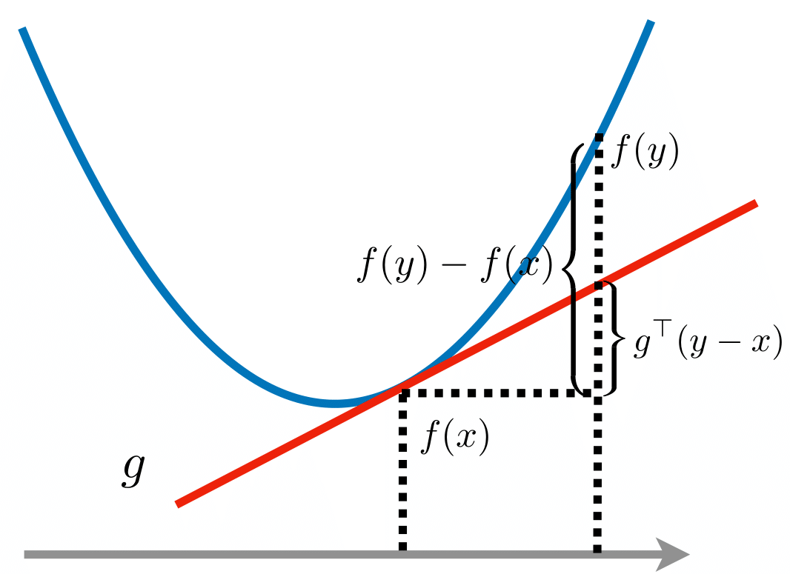
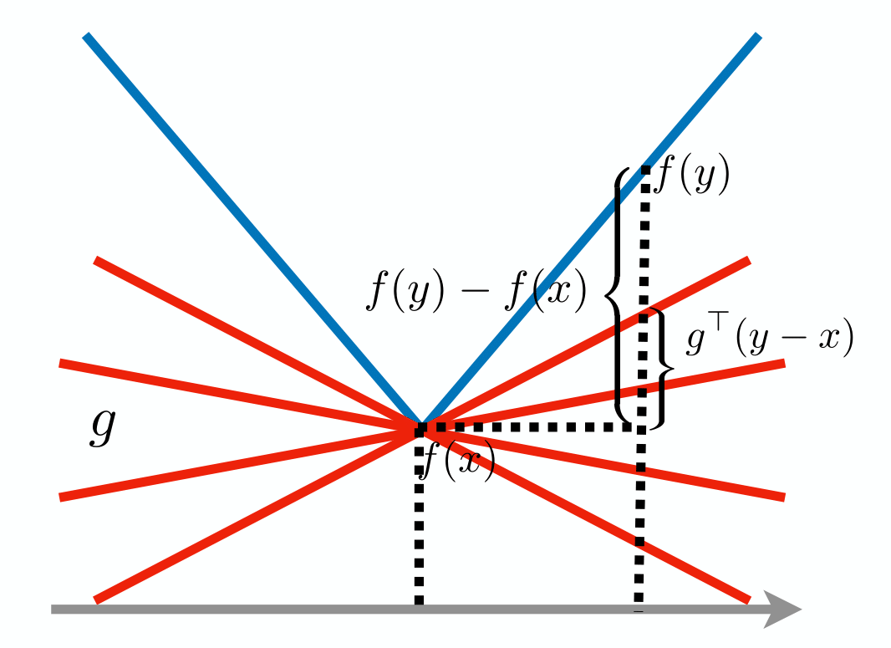

# Convex Optimization

## Convex Problems

Many statistical estimators can be formulated as optimization problems. A classic example is the Lasso estimator:

$$
\min_{\beta \in \mathbb{R}^d} \frac{1}{2n}\|Y-X\beta\|_2^2 + \lambda\|\beta\|_1,
$$

where $\|\beta\|_1 = \sum_{j=1}^d |\beta_j|$ is the $\ell_1$ norm penalty to encourage sparsity of $\beta$, i.e., making most of the coefficients of $\beta$ zero.

This is an unconstrained problem as we find the minimizer over the entire $\mathbb{R}^d$. For comparison, the constrained Lasso is formulated as:

$$
\min_{\beta} \|Y - X\beta\|_2^2, \text{ subject to } \|\beta\|_1 \leq t
$$

which has the constraint $\|\beta\|_1 \leq t$.

Notice that the loss function of Lasso is not smooth because of the $\ell_1$ penalty. We will mainly focus on the smooth objective functions and constraints and the content involving non-smooth functions will be optional.

### Gradient and Hessian

When dealing with a $d$-dimensional function $f: \mathbb{R}^d \rightarrow \mathbb{R}$, optimization typically involves its gradient $\nabla f \in \mathbb{R}^d$ and Hessian matrix $\nabla^2 f \in \mathbb{R}^{d\times d}$. For modern data analysis, it's preferable to use only gradients and avoid Hessian matrices because:

- Vector operations are much faster than matrix operations
- When $d$ is extremely large (e.g., millions in genomics datasets), storing a $d \times d$ matrix becomes impractical

Optimization algorithms that only use gradients are called **first-order methods**.  And the algorithms that use both gradients and Hessian matrices are called **second-order methods**.

### Convex Sets and Functions

**Definition** (Convex set and function):
1. A set $\mathcal{X}$ is convex if 
   $$
   (1-\gamma)x + \gamma y \in \mathcal{X}, \text{ for any } x, y \in \mathcal{X}, \gamma \in [0,1]
   $$ 

2. A function $f: \mathcal{X} \rightarrow \mathbb{R}$ is convex if 
   $$
   f((1-\gamma)x + \gamma y) \leq (1-\gamma)f(x) + \gamma f(y), \text{ for any } x,y \in \mathcal{X}, \gamma \in [0,1]
   $$

Geometrically, a set is convex if it contains all line segments between any two points in the set. A function is convex if its graph lies below or on any chord connecting two points on the graph.

**Definition** (Convex optimization):
An optimization problem is called convex optimization if it can be formulated as:

$$
\begin{align}
&\min_x f(x)\\
&\text{subject to } x \in \mathcal{X}
\end{align}
$$

where both $f$ and $\mathcal{X}$ are convex.

Both the unconstrained and constrained Lasso are examples of convex optimization problems.

Many optimization problems in data analysis have nice properties. We will formally define the nice properties called "strongly convex" and "smooth" below, but informally speaking, an objective function $f(x)$ is good enough if it can be upper and lower bounded by a quadratic function:

$$
 f(x) + \nabla f(x)^\top(y-x) + \frac{\mu}{2}\|x-y\|_2^2 \leq f(y) \leq f(x) + \nabla f(x)^\top(y-x) + \frac{L}{2}\|x-y\|_2^2
 f(y) 
$$

for any points $x$ and $y$.

Most of time $f$ has Hessian matrix $\nabla^2 f(x)$, and the above inequality is equivalent to the eigenvalue condition:

$$
0< \mu \leq \lambda_{\min}(\nabla^2 f(x)) \leq \lambda_{\max}(\nabla^2 f(x)) \leq L < \infty
$$

However, in the so-called "high-dimensional statistics" case, when the sample size $n$ is much smaller than the number of parameters $d$, the objective function $f$ is usually only convex but not strongly convex, e.g., the Lasso in the beginning.

The following figure shows the illustration of the above inequality.

### Strong Convexity Condition

For optimization algorithms to converge efficiently, the function $f(x)$ should not only be convex but also exhibit a certain level of curvature. This is formalized with the concept of strong convexity.

**Definition** (Strongly Convex): A continuously differentiable function $f$ is $\mu$-strongly convex if:

$$
f(y) \geq f(x) + \nabla f(x)^\top(y-x) + \frac{\mu}{2}\|x-y\|_2^2
$$

for any points $x$ and $y$.

The expression $f(x) + \nabla f(x)^\top(y-x)$ represents the first-order Taylor expansion of $f(y)$. Strong convexity means that the function $f(y)$ is bounded below by its first-order approximation plus a quadratic term $\frac{\mu}{2}\|x-y\|_2^2$.

For functions with second derivatives, the second-order Taylor expansion gives:

$$
f(y) \approx f(x) + \nabla f(x)^\top(y-x) + \frac{1}{2}(y-x)^\top \nabla^2 f(x)(y-x)
$$

Comparing this with the strong convexity definition, we can see that strong convexity implies the Hessian $\nabla^2 f(x)$ must be sufficiently large. In fact, strong convexity is equivalent to the following properties:

- If $f$ has second derivatives, strong convexity is equivalent to $\nabla^2 f(x) \succeq \mu \mathbf{I}_d$ for any $x$, which ensures that $f$ has a minimum level of curvature.
- Strong convexity is also equivalent to $\|\nabla f(x) - \nabla f(y)\|_2 \geq \mu\|x-y\|_2$, meaning the gradient of $f$ changes at least linearly with respect to the distance between $x$ and $y$.

For example, the quadratic function $f(x) = \frac{1}{2}x^\top Q x$ is $\mu$-strongly convex if the smallest eigenvalue of $Q$ is at least $\mu$.

In contrast, a linear function $f(x) = a^\top x + b$ is not strongly convex because it lacks curvature.

### Smoothness Condition

For gradient descent to converge effectively, the function $f(x)$ cannot be too steep or irregular. We formalize this requirement with the concept of $L$-smoothness.

**Definition** ($L$-smooth): A continuously differentiable function $f$ is $L$-smooth if:

$$
f(y) \leq f(x) + \nabla f(x)^\top(y-x) + \frac{L}{2}\|x-y\|_2^2
$$

for any points $x$ and $y$.

The expression $f(x) + \nabla f(x)^\top(y-x)$ represents the first-order Taylor expansion of $f(y)$. So $L$-smoothness means that the difference between the function and its first-order approximation can be bounded by the quadratic term $\frac{L}{2}\|y-x\|_2^2$.

For functions with second derivatives, the second-order Taylor expansion gives:

$$
f(y) \approx f(x) + \nabla f(x)^\top(y-x) + \frac{1}{2}(y-x)^\top \nabla^2 f(x)(y-x)
$$

Comparing this with the $L$-smoothness definition, we can see that $L$-smoothness implies the Hessian $\nabla^2 f(x)$ cannot be too large. In fact, $L$-smoothness is equivalent to the following properties:

- If $f$ has second derivatives, $L$-smoothness is equivalent to $\nabla^2f(x) \preceq L\mathbf{I}_d$ for any $x$, which prevents $f$ from being too curved.
- $L$-smoothness is also equivalent to $\|\nabla f(x) - \nabla f(y)\|_2 \leq L\|x-y\|_2$, meaning the gradient of $f$ is Lipschitz continuous and doesn't change too drastically.

For example, the least squares loss $f(\beta) = \frac{1}{2}\|Y - X \beta\|_2^2$ has Hessian matrix $\nabla^2 f(x) = X X^\top$. This loss is $L$-smooth if the maximum eigenvalue of $X X^\top$ is less than $L$.

In contrast, the $\ell_1$-norm $\|x\|_1$ is not smooth because its derivative is not continuous at $x=0$.

## Subgradient

In high-dimensional optimization, first-order methods are preferred, which requires understanding gradient properties. However, many convex functions are not smooth and don't have gradients everywhere. For example, the $\ell_1$-norm $\|x\|_1$ is not differentiable at points where any component equals zero.

To handle non-smooth convex functions, we can generalize the concept of gradient using subgradients.

**Definition** (Subgradient):
Let $f: \mathcal{X} \rightarrow \mathbb{R}$. We say $g \in \mathbb{R}^d$ is a subgradient of $f$ at $x$ if for any $y \in \mathcal{X}$:

$$
f(y) - f(x) \geq g^\top(y-x)
$$

We denote the set of all subgradients of $f$ at $x$ as $\partial f(x)$.

Geometrically, a subgradient at point $x$ defines a supporting hyperplane to the function's graph. The hyperplane tangent to $f$ at $x$ is $p(y) = g^\top(y-x)+ f(x)$. The inequality $f(y) - f(x) \geq g^\top(y-x)$ means that the function $f$ lies above this hyperplane.

Notice that $\partial f(x)$ is a set, not a single vector. When a function is convex, subgradients always exist. For differentiable convex functions, the gradient is the unique subgradient: $\partial f(x) = \{\nabla f(x)\}$. However, for non-differentiable points, there may be multiple subgradients.

### Example: Subgradient of $\ell_1$-norm

The $\ell_1$-norm is one of the most widely used non-smooth convex functions. Let's start with the one-dimensional case $f(x) = |x|$:

- When $x \neq 0$, $f$ is differentiable and $\partial |x| = \{{\rm sign}(x)\}$
- When $x = 0$, $f$ is non-differentiable and $\partial |x| = [-1,1]$ (all values in this interval are valid subgradients)

For the multi-dimensional $\ell_1$-norm $\|x\|_1$, if $g \in \partial \|x\|_1$, then:
- $g_j = {\rm sign}(x_j)$ for components where $x_j \neq 0$
- $g_j \in [-1,1]$ for components where $x_j = 0$

### Optimality Conditions in Convex Optimization

One important property of convex functions is that local minima are always global minima:

**Proposition** (Local minima are global minima):
Let $f$ be convex. If $x^*$ is a local minimum of $f$, then $x^*$ is its global minimum. This happens if and only if $0 \in \partial f(x^*)$.

This is one reason why convex optimization is generally easier than non-convex optimization.

For constrained problems, we have the following first-order optimality condition:

**Proposition** (First-order optimality condition):
Given a convex set $\mathcal{X}$ and a convex differentiable function $f: \mathcal{X} \rightarrow \mathbb{R}$, $x^* \in \arg\min_x f(x)$ subject to $x \in \mathcal{X}$ if and only if:

$$
\nabla f(x^*)^\top(y - x^*) \geq 0, \text{ for all } y \in \mathcal{X}
$$

Geometrically, this means that the angle between the gradient $\nabla f(x^*)$ and any feasible direction $(y - x^*)$ is non-acute.

The optimality conditions for convex optimization can be summarized as follows:

| | Unconstrained | Constrained |
|---|---|---|
| Zero-order | $f(x^*) \leq f(y)$ | $f(x^*) \leq f(y)$ |
| First-order | $0 \in \partial f(x^*)$ | $\nabla f(x^*)^\top(y - x^*) \geq 0$ |

These optimality conditions are powerful tools for:
1. Checking whether a given point is optimal
2. Deriving algorithms to find optimal solutions
3. Understanding the geometric properties of optimal solutions 