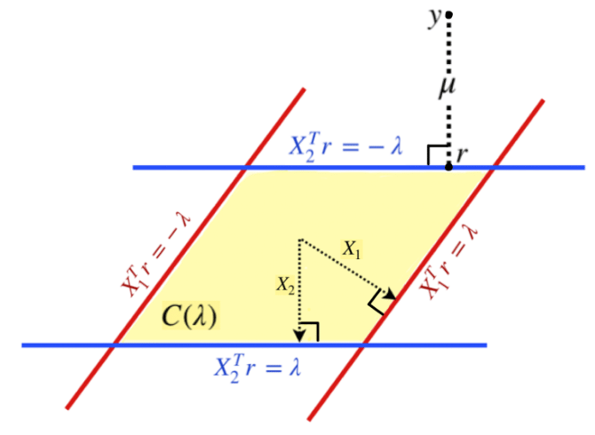
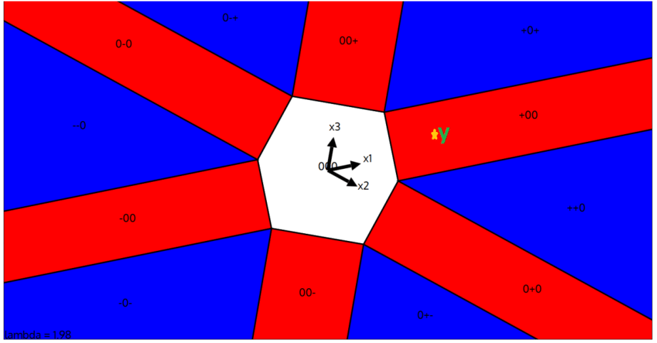

# Duality and ADMM

## Composite Objective Function

We have introduced proximal gradient descent to solve optimization problems of the form $\min_x f(x) + g(x)$, where $f$ is smooth but $g$ is not differentiable. A key step in proximal gradient descent is solving the proximal operator:

$$
{\rm prox}_g(x) = \arg\min_{z\in\mathbb{R}^d}\left\{\frac{1}{2} \|z-x\|_2^2 + g(z)\right\}
$$

For example, when $g(x) = \lambda \|x\|_1$, the proximal operator is soft-thresholding. For the fused Lasso problem:

$$
\min_{\beta} \|Y - X\beta\|_2^2 + \lambda \|D\beta\|_1
$$

where $D$ is some matrix representing the differential map, applying proximal gradient descent requires solving:

$$
\arg\min_{z\in\mathbb{R}^d}\left\{\frac{1}{2} \|z-x\|_2^2 + \lambda \|Dz\|_1\right\}
$$

Unlike the $\ell_1$-norm, this problem lacks a closed-form solution, making proximal gradient descent inefficient for fused Lasso.

We discuss solving composite objective functions. Generally, we are interested in the following composite optimization problem:

$$
\min_{x,y} f(x) + g(y), \text{ s.t. } Ax + By = c
$$

for some convex $f$ and $g$. The fused Lasso can be reduced to this form by letting $f(\beta) = \|Y - X\beta\|_2^2$, $g(y) = \lambda \|y\|_1$, so:

$$
\min_{\beta} \|Y - X\beta\|_2^2 + \lambda \|D\beta\|_1 \Longleftrightarrow \min_{\beta,y} f(\beta) + g(y), \text{ s.t. } D\beta - y = 0
$$

Another example is basis pursuit:

$$
\min_{\beta} \|\beta\|_1 \text{ s.t. } X\beta - Y = 0
$$

## Duality

To solve the composite optimization problem, we start by reviewing duality in optimization. We define the Lagrange multiplier function of the problem as:

$$
L(x,y, \lambda) = f(x) + g(y) + \lambda^\top(Ax + By -c)
$$

This allows us to convert the **primal problem** to the **dual problem**:

$$
\max_{\lambda} h(\lambda), \text{ where } h(\lambda) = \min_{x,y}L(x,y, \lambda)
$$

Duality is crucial in optimization. The following theorem implies we can solve the primal problem via the dual problem.

**Theorem** (Strong Duality): Given convex functions $f,g$, the primal problem has the solution:

$$
(x^*, y^*) = \arg\min_{x,y} f(x) + g(y), \text{ s.t. } Ax + By = c
$$

Consider the dual problem $\lambda^* = \arg\max_{\lambda} h(\lambda)$, where $h(\lambda) = \min_{x,y}L(x,y, \lambda)$. We can solve $(x^*, y^*)$ via:

$$
(x^*, y^*) = \arg\min_{x,y} L(x,y, \lambda^*)
$$

As $L(x,y, \lambda^*)$ is decomposable, we further have:

$$
x^* = \arg\min_x f(x) + \lambda^{*\top} Ax \text{ and } y^* = \arg\min_y g(y) + \lambda^{*\top} By
$$

The strong duality property is useful for converting a linear constraint problem to an unconstrained dual problem. The following example shows how to find the dual problem of Lasso.

### Example: Duality of Lasso

As Lasso is an unconstrained problem, we first convert it to the standard form:

$$
\min_\beta \frac{1}{2}\|Y - X\beta\|_2^2 + \lambda\|\beta\|_1 \iff \min_{\beta, z} \frac{1}{2}\|z\|_2^2 + \lambda\|\beta\|_1, \text{ s.t. } Y - X\beta = z
$$

The Lagrange function is:

$$
L(\beta, z, \mu) = \frac{1}{2}\|z\|^2_2 + \lambda\|\beta\|_1 + \mu^\top (Y - X\beta -z)
$$

Notice that $L(\beta, z, \mu)$ is decomposable:

$$
\min_{\beta,z}L(\beta, z, \mu) = \min_\beta \left\{\lambda\|\beta\|_1 - \mu^\top X\beta \right\}+ \min_z \left\{\frac{1}{2}\|z\|^2_2 - \mu^\top z\right\} + \mu^\top Y
$$

The second problem is quadratic, and we have:

$$
z^* = \arg\min_z \left\{\frac{1}{2}\|z\|^2_2 - \mu^\top z \right\} \implies z^* - \mu = 0
$$

Applying the first-order optimality condition to the first problem, we get:

$$
\beta^* = \arg\min_\beta \left\{\lambda\|\beta\|_1 - \mu^\top X\beta \right\} \implies 0 = -X^\top \mu + \lambda g, \text{ for some } g \in \partial \|\beta^*\|_1
$$

As $\|g\|_\infty \le 1$, the equality $0 = -X^\top \mu + \lambda g$ has a finite solution only if $\lambda \geq \|X^\top \mu\|_\infty$. Moreover, if $\lambda \geq \|X^\top \mu\|_\infty$, multiplying $\beta^*$ on both sides of $0 = -X^\top \mu + \lambda g$ gives:

$$
0 = -\beta^{*\top}X^\top \mu + \lambda \|\beta^*\|_1
$$

Therefore, we have:

$$
\min_\beta \left\{\lambda\|\beta\|_1 - \mu^\top X\beta \right\} = \begin{cases} 0, &\text{if } \lambda \geq \|X^\top \mu\|_\infty; \\ -\infty, &\text{if } \lambda < \|X^\top \mu\|_\infty. \end{cases}
$$

Combining the results, the dual problem becomes:

$$
\max_{\lambda} \min_{\beta,z}L(\beta, z, \mu) = \max_{\lambda}\left\{-\frac{1}{2}\|\mu\|_2^2 + \mu^\top Y\right\} \text{ s.t. } \lambda \geq \|X^\top \mu\|_\infty
$$

Therefore, the dual problem of Lasso is:

$$
\max_\mu L(\beta^*, z^*, \mu) = \max_\mu -\frac{1}{2}\|\mu\|_2^2 + \mu^\top Y \text{ s.t. } \|X^\top \mu\|_\infty \le \lambda
$$

This is equivalent to:

$$
\text{**Duality of Lasso**}: \min_{\mu} \|Y - \mu\|_2^2, \text{ s.t. } \|X^\top \mu\|_\infty \le \lambda
$$

By the duality, the dual variable $\mu^* = z^* = Y - X\beta^*$ is the residual. This gives a new geometric insight into Lasso, illustrating that Lasso is a projection, similar to OLS.

## Alternating Direction Method of Multipliers (ADMM)

Consider an equivalent form of the problem by adding a quadratic term:

$$
\left\{\begin{aligned}&\min_{x,y} f(x) + g(y)\\&\text{ s.t. } Ax + By = c,\end{aligned}\right\} \Longleftrightarrow \left\{\begin{aligned}&\min_{x,y}f(x) + g(y) + \frac{\rho}{2}\|Ax + By -c\|_2^2\\&\text{ s.t. }Ax + By = c.\end{aligned}\right\}
$$

We introduce the **augmented Lagrangian**:

$$
L_{\rho} (x,y,\lambda) = f(x) + g(y) + \lambda^\top (Ax + By -c) +\frac{\rho}{2}\|Ax + By -c\|_2^2
$$

To solve the dual problem $\max_\lambda \min_{x,y} L_{\rho} (x,y,\lambda)$, we propose updating the primal and dual variables alternately:

**Primal step**:

$$
\begin{cases}x_{t+1}= \arg\min_x L_{\rho}(x, y_t, \lambda_t);\\y_{t+1}= \arg\min_y L_{\rho}(x_{t+1}, y, \lambda_t);\end{cases}
$$

**Dual step**:

$$
\lambda_{t+1}= \arg\max_\lambda L_{\rho}(x_{t+1}, y_{t+1}, \lambda) -\frac{1}{2\rho}\|\lambda - \lambda_t\|_2^2
$$

We add a proximal term in the dual step because the augmented Lagrangian $L_{\rho}(x_{t+1}, y_{t+1}, \lambda)$ is linear with respect to $\lambda$, making $\max_{\lambda} L_{\rho}(x_{t+1}, y_{t+1}, \lambda) = \infty$. The proximal term prevents $\lambda_{t+1}$ from deviating too much from $\lambda_t$.

Plugging the augmented Lagrangian into the primal and dual steps, we have the following algorithm.

**ADMM Algorithm**:

$$
\begin{align*}x_{t+1} &= \arg\min_x f(x) + \frac{\rho}{2} \|Ax + By_t - c + \lambda_t/\rho\|_2^2\\y_{t+1} &= \arg\min_y g(x) + \frac{\rho}{2} \|Ax_{t+1} + By - c + \lambda_t/\rho\|_2^2\\\lambda_{t+1} &= \lambda_t + \rho(Ax_{t+1} + By_{t+1} - c)\end{align*}
$$

If $f$ and $g$ are closed convex functions, the ADMM algorithm converges.

### Example: Fused Lasso

Applying ADMM to the fused Lasso:

$$
\min_{\beta } \frac{1}{2}\|Y - X\beta\|_2^2 + \lambda \|D\beta\|_1 \iff \min_{\beta,z } \frac{1}{2}\|Y - X\beta\|_2^2 + \lambda \|z\|_1 \text{ s.t. } D\beta - z=0
$$

The updating rule is:

$$
\begin{align*}\beta_{t+1}&= \arg\min_\beta \frac{1}{2}\|Y - X\beta\|_2^2 + \frac{\rho}{2}\|D\beta -z_t + \lambda_t/\rho\|_2^2\\z_{t+1}&= \arg\min_z \lambda\|z\|_1 + \frac{\rho}{2}\|D\beta_{t+1} -z + \lambda_t/\rho\|_2^2\\\lambda_{t+1} &= \lambda_t + \rho(D\beta_{t+1} - z_{t+1})\end{align*}
$$

This yields the algorithm:

$$
\begin{align*}\beta_{t+1}&= (X^\top X + \rho D^\top D)^{-1} (X^\top Y + \rho D^\top z_{t} - D^\top\lambda_{t})\\z_{t+1}&= \text{SoftThreshold}(D\beta_{t+1}+ \lambda_t/\rho, \lambda/\rho)\\\lambda_{t+1} &= \lambda_t + \rho(D\beta_{t+1} - z_{t+1})\end{align*}
$$

When $D = I$, the algorithm reduces to ADMM for Lasso. Unlike FISTA, ADMM involves matrix inversion, which may be time-consuming when $d$ is large.

### Example: Graphical Lasso

Given i.i.d. samples $X_1, \ldots, X_n \sim N(0, \Sigma)$, we estimate the precision matrix $\Theta = \Sigma^{-1}$ via graphical Lasso:

$$
\begin{align*}&\min_{\Theta } -\log \det \Theta + \text{tr}{(\Theta^\top \hat{\Sigma})} + \lambda\|\Theta\|_{1,1} \\\Updownarrow\\&\min_{\Theta, \Psi } -\log \det \Theta + \text{tr}{(\Theta^\top \hat{\Sigma})} + \lambda\|\Psi\|_{1,1} \text{ s.t. } \Theta = \Psi\end{align*}
$$

Applying ADMM, we get:

$$
\begin{align*}\Theta_{t+1}&= \arg\min_\Theta -\log \det \Theta + \text{tr}{(\Theta^\top \hat{\Sigma})} + \frac{\rho}{2}\|\Theta - \Psi_t+ \Lambda_t/{\rho}\|_{\rm F}^2\\\Psi_{t+1}&= \arg\min_\Psi\lambda\|\Psi\|_{1,1} + \frac{\rho}{2}\|\Theta_{t+1} - \Psi+ \Lambda_t/{\rho}\|_{\rm F}^2\\\Lambda_{t+1}&= \Lambda_t + \rho(\Theta_{t+1} - \Psi_{t+1} )\end{align*}
$$

where the Frobenius norm $\|A\|_{\rm F}^2 = \sum_{jk}A_{jk}^2$. This simplifies to:

$$
\begin{align*}\Theta_{t+1}&= \mathcal{F}_{\rho}(\Psi_t- \Lambda_t/{\rho} - \widehat \Sigma/{\rho} )\\\Psi_{t+1}&= \text{SoftThreshold}(\Theta_{t+1}+ \Lambda_t/{\rho}, \lambda/\rho)\\\Lambda_{t+1}&= \Lambda_t + \rho(\Theta_{t+1} - \Psi_{t+1} )\end{align*}
$$

where for the spectral decomposition $X = UDU^\top$, $\mathcal{F}_{\rho}(X) = U{\rm diag}\{\lambda_i + \sqrt{\lambda_i + 4/\rho}\}U^\top$.

### Example: Consensus Optimization

We design a divide-and-conquer ADMM for Lasso for massive data when $n$ is ultra-large. The Lasso:

$$
\min_{\beta } \sum_{i=1}^n (Y_i - X_i\beta)^2 + \lambda\|\beta\|_1
$$

can be formulated as the general block separable form:

$$
\min_x \sum_{i=1}^n f_i(x) \iff \min_{x_i,z}\sum_{i=1}^n f_i(x) \text{ s.t. } x_i = z \text{ for all } i = 1, \ldots, n
$$

Applying ADMM, we get:

**Divide**:

$$
x_i^{t+1}= \arg\min_{x_i} f_i(x_i) + \frac{\rho}{2}\|x_i - z^t + \lambda_i^t/{\rho}\|_2^2, \forall i = 1, \ldots, n
$$

**Gather**:

$$
z^{t+1} =\frac{1}{n}\sum_{i=1}^n (x_i^{t+1}+ \lambda_i^t/{\rho})
$$

**Broadcast**:

$$
\lambda_i^{t+1}= \lambda_i^t + \rho(x_i^{t+1}- z^{t+1} ), \forall i = 1, \ldots, n
$$

In the first step, we update each $x_i^{t+1}$ in parallel, then gather all local iterates, and finally broadcast the updated dual variables back to each core. 