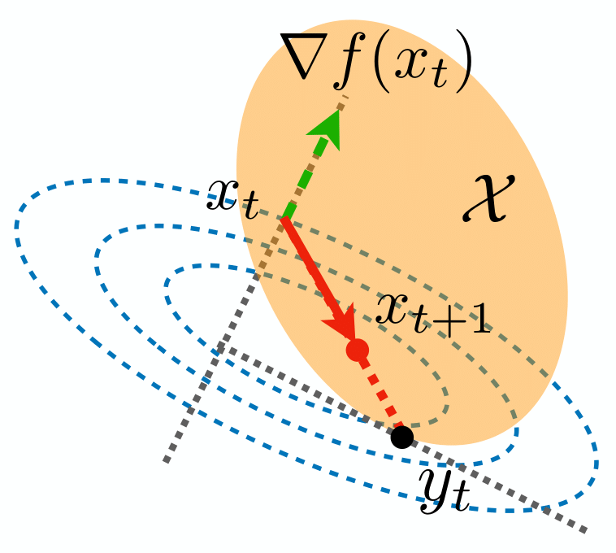
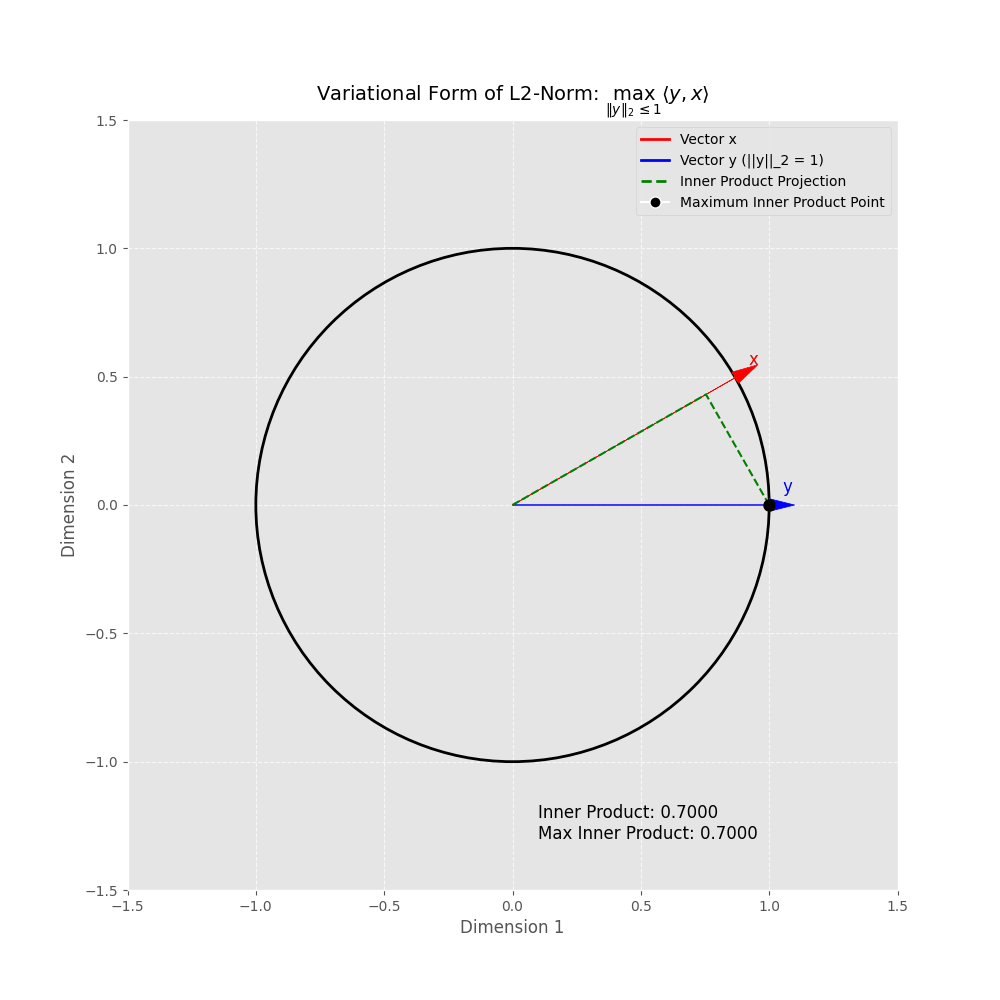
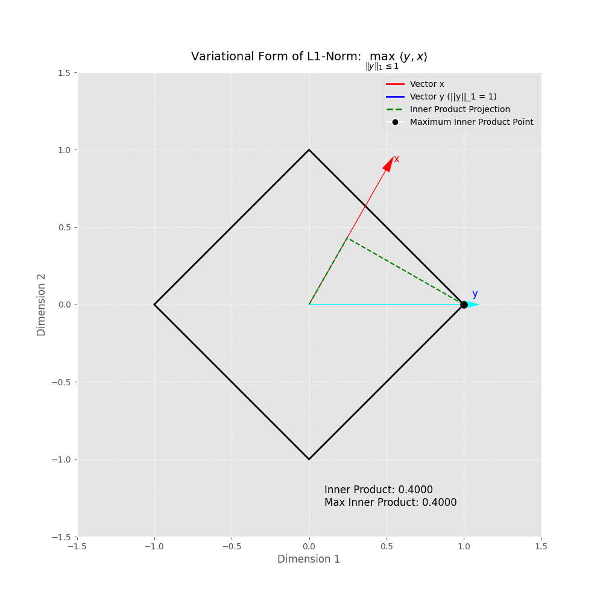

# Gradient Descent

We'll explore algorithms for solving convex optimization problems of the form:

$$
\min_{x \in \mathcal{X}} f(x), \text{ where $f$ and $\mathcal{X}$ are convex}
$$

Our goal is to find the minimizer $x^* = \arg\min_{x\in \mathcal{X}}f(x)$. Let's start with the unconstrained case where $\mathcal{X} = \mathbb{R}^d$.

If we begin our search at some point $x_0$, we want to move in a direction that decreases the value of $f(x)$. When moving along direction $d$ with a small step size $\tau$, the decrease in the objective function is:

$$
\lim_{\tau \rightarrow 0}\frac{f(x_0+\tau d) - f(x_0)}{\tau} = \nabla f(x_0)^\top d
$$

To maximize this decrease, we should choose $d = -\nabla f(x_0)$. This means the negative gradient $-\nabla f(x_0)$ provides the steepest descent direction when we only have local information about $f(x)$ at point $x_0$. This insight leads to the gradient descent algorithm.

**Gradient Descent Algorithm**: Starting at point $x_0 \in \mathbb{R}^d$, iterate as follows:

$$
x_{t+1} = x_t -\eta_t\nabla f(x_t)
$$

where $\eta_t$ is the step size (also called learning rate).

### Convergence of Gradient Descent

The following theorem shows how quickly gradient descent converges:

**Theorem** (Convergence of gradient descent): Let $f$ be convex and $L$-smooth. If we choose $\eta_t = 1/L$, then gradient descent achieves:

$$
f(x_t) - f(x^*) \leq \frac{2L\|x_0 - x^*\|_2^2}{t}
$$

This means gradient descent has a convergence rate of $O(1/t)$, or equivalently, it can achieve $\epsilon$-accuracy ($f(x_t) - f(x^*) \leq \epsilon$) within $O(1/\epsilon)$ steps.

## Frank-Wolfe Algorithm

Now let's consider the constrained problem $\min_{x \in \mathcal{X}} f(x)$. The standard gradient descent might cause $x_t$ to leave the constraint set $\mathcal{X}$. As shown in the figure below, we still want to find the steepest descent direction, but we need to ensure that $x_t$ remains in $\mathcal{X}$ for all iterations.

Starting with $x_0 \in \mathcal{X}$, we want to find the steepest descent direction $d = x - x_0$ with $x \in \mathcal{X}$ by solving:

$$
\arg\min_{x \in \mathcal{X}}\langle\nabla f(x_0), x - x_0\rangle = \arg\min_{x \in \mathcal{X}} \langle\nabla f(x_0), x \rangle
$$

This leads to the Frank-Wolfe algorithm:

**Frank-Wolfe Algorithm**: Perform the updates:

$$
\begin{align}
y_t &= \arg\min_{x \in \mathcal{X}} \langle\nabla f(x_t), x \rangle\\
x_{t+1} &= x_t + \eta_t (y_t - x_t)
\end{align}
$$

where $\eta_t$ is the step size.

### Example: Power Iteration

The leading eigenvector of a positive semi-definite matrix $A$ is the solution to:

$$
\max_{\|x\|_2 \leq 1} x^\top A x = \min_{\|x\|_2 \leq 1} -x^\top A x
$$

Although $f(x) = -x^\top A x$ is concave (not convex) when $A \succeq 0$, we can still apply the Frank-Wolfe algorithm. We need to solve:

$$
y_t = \arg\min_{\|x\|_2 \leq 1} \langle\nabla f(x_t), x \rangle = -\frac{\nabla f(x_t)}{\|\nabla f(x_t)\|_2} = \frac{Ax_t}{\|Ax_t\|_2}
$$

where we use the fact that $\arg\max_{\|x\|_2 \leq 1} \langle y, x \rangle = y/\|y\|_2$, which can be shown by the plot below.

This gives us the update rule:

$$
x_{t+1} = x_t + \eta_t\left(\frac{Ax_t}{\|Ax_t\|_2} - x_t\right) = (1-\eta_t)x_t + \eta_t\frac{Ax_t}{\|Ax_t\|_2}
$$

Choosing the optimal step size $\eta_t = 1$ yields $x_{t+1} = \frac{Ax_t}{\|Ax_t\|_2}$, which is the power iteration method for finding the leading eigenvector of $A$.

### Example: Constrained Lasso

The following two constrained Lasso formulations are equivalent:

$$
\begin{align}
\min_{\beta} \|Y - X\beta\|_2^2 \text{ s.t. } \|\beta\|_1 \leq \lambda
\end{align}
\Longleftrightarrow
\begin{align}
\min_{\beta} \|Y/\lambda - X\beta\|_2^2 \text{ s.t. } \|\beta\|_1 \leq 1
\end{align}
$$

So without loss of generality, we can assume $\lambda = 1$. Applying the Frank-Wolfe algorithm, we need to solve:

$$
y_t = \arg\min_{\|\beta\|_1 \leq 1} \langle\nabla f(\beta_t), \beta \rangle
$$

where $\nabla f(\beta_t) = -2X^\top(Y - X\beta_t)$.

Using the variational form of the $\ell_1$-norm, we know that:

$$
\arg\max_{\|y\|_1 \leq 1} \langle y,x \rangle = (0,\dots, 0,\text{sign}(x_{j^*}),0, \dots, 0)^\top
$$

where $j^* = \arg\max_{1 \leq j \leq d}|x_j|$.

The visualization of the variational form of the $\ell_1$-norm is shown below.

This gives us:

$$
(y_{t})_j = 
\begin{cases}
-\text{sign}(\nabla_j f(\beta_t)), & \text{if } j = \arg\max_k |\nabla_k f(\beta_t)|\\
0, & \text{otherwise}
\end{cases}
$$

$$
\beta_{t+1} = (1-\eta_t)\beta_t + \eta_ty_t
$$

Since only one entry of $y_t$ is nonzero, each iteration adds at most one nonzero entry to $\beta_{t+1}$. Starting with $\beta_0 = 0$, we have $\|\beta_t\|_0 \leq t$, making the algorithm efficient and providing insight into why the $\ell_1$ constraint promotes sparsity.

### Convergence of Frank-Wolfe

**Theorem** (Convergence rate of Frank-Wolfe algorithm): Let $f$ be convex and $L$-smooth. If we choose $\eta_t = \frac{2}{t+2}$, then the Frank-Wolfe algorithm achieves:

$$
f(x_t) - f(x^*) \leq \frac{2Ld_\mathcal{X}^2}{t+2}
$$

where $d_\mathcal{X}^2 = \sup_{x,y \in \mathcal{X}}\|x-y\|_2^2$.

Like gradient descent, Frank-Wolfe has a convergence rate of $O(1/t)$ for convex and smooth functions, requiring $O(1/\epsilon)$ steps to achieve $\epsilon$-accuracy. However, unlike gradient descent's constant step size, Frank-Wolfe uses a diminishing step size that doesn't depend on the smoothness parameter $L$.

