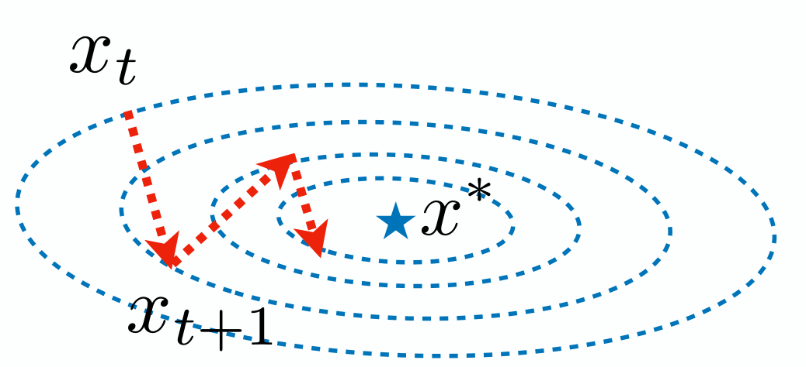
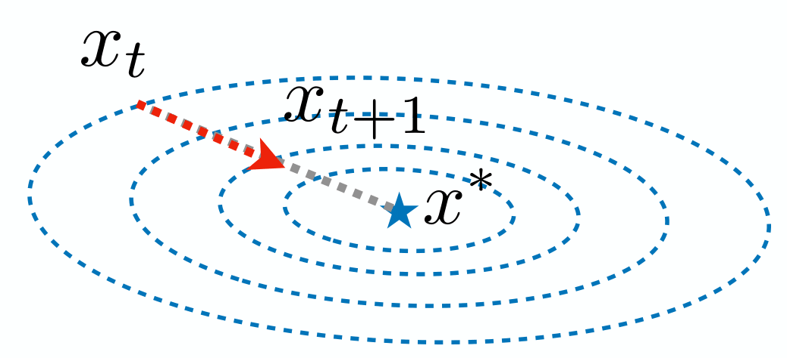
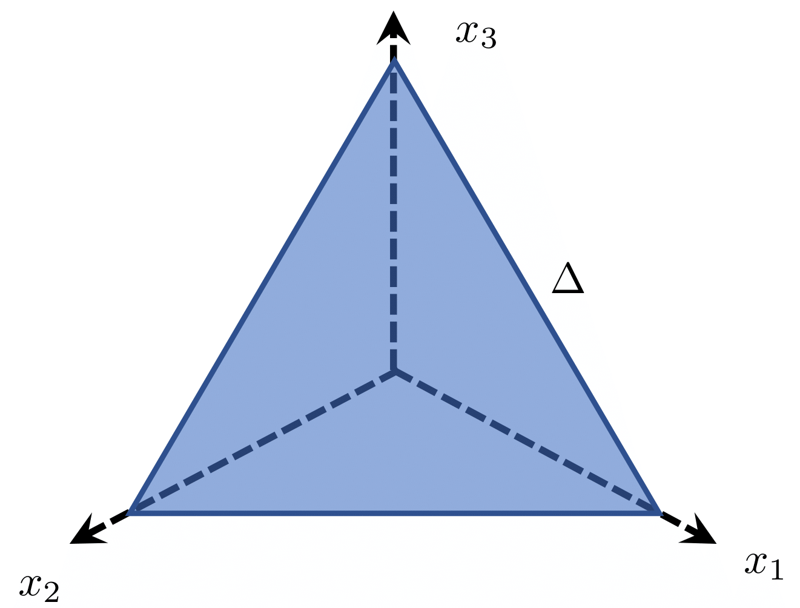
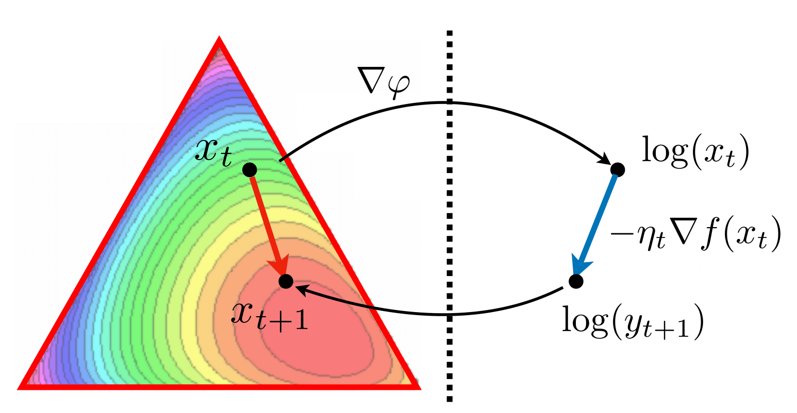

# Mirror Descent

## Bregman Divergence

In the previous lecture, we introduced the proximal perspective of gradient descent. To minimize $f(x)$, we approximate the objective function $f(x)$ around $x=x_t$ using a quadratic function:

$$
f(x) \approx f(x_t)+\langle \nabla f(x_t), x-x_t\rangle + \frac{1}{2\eta_t}\|x-x_t\|_2^2
$$

This is composed of the first-order Taylor expansion and a proximal term. For constrained optimization $\min_{x\in \mathcal{X}}f(x)$, starting at $x_t$, we update the next step by minimizing this quadratic approximation:

$$
x_{t+1} = \arg\min_{x\in\mathcal{X}}\left\{ f(x_t)+\langle \nabla f(x_t), x-x_t\rangle + \frac{1}{2\eta_t}\|x-x_t\|_2^2 \right\}
$$

If there are no constraints, i.e., $\mathcal{X} = \mathbb{R}^d$, this step simplifies to $x_{t+1} = x_t -\eta_t\nabla f(x_t)$. Otherwise, it becomes projected gradient descent. Without the proximal term, it reduces to the Frank-Wolfe algorithm. The proximal term $\frac{1}{2\eta_t}\|x-x_t\|_2^2$ prevents $x_{t+1}$ from straying too far from $x_t$. A natural question arises: why use the $\ell_2$-norm in the proximal term? Can we use another distance?

### Example: Quadratic Optimization

Consider the quadratic optimization problem:

$$
\min_{x\in \mathbb{R}^d}f(x) = \min_{x\in \mathbb{R}^d} \frac{1}{2}(x - x^*)^\top Q (x - x^*)
$$

where $Q$ is a positive definite matrix.

Using the $\ell_2$-norm in the proximal term, we have gradient descent:

$$
x_{t+1} = x_t - \eta_t Q(x_t-x^*)
$$

In figure above, the trajectory of gradient descent is zigzag. This zigzag pattern occurs because the $\ell_2$-norm is not the ideal distance for the objective $f(x)$. The contour is scaled by matrix $Q$. What if we use the norm $\|x\|_Q^2 = x^\top Q x$ in the proximal term? Then we update $x_{t+1}$ as:

$$
x_{t+1} = x_t - \eta_t Q^{-1}\nabla f(x_t) = x_t - \eta_t (x_t-x^*)
$$

In figure above, the descent direction directly points to the minimizer $x^*$, resulting in a much faster algorithm.

### Bregman Divergence

The previous example shows the need for a better distance fitting the problem's geometry. This motivates the definition of Bregman divergence.

**Definition** (Bregman Divergence): Let $\varphi: \mathcal{X} \rightarrow \mathbb{R}$ be a convex and differentiable function. The Bregman divergence between $x$ and $z$ is:

$$
D_{\varphi}(x,z) = \varphi(x) - \varphi(z) - \langle \nabla\varphi(z), x - z\rangle
$$

By convexity, $D_{\varphi}(x,z) \ge 0$, making it a type of distance. The Bregman divergence generalizes the quadratic norm $\|\cdot\|_Q$.

The table below shows some common Bregman divergences.

| Function Name     | $\phi(x)$                  | $\text{dom } \phi$ | $D_{\phi}(x, y)$ |
|------------------|----------------------------|----------------------|--------------------|
| Squared norm    | $\frac{1}{2} x^2$        | $(-\infty, +\infty)$ | $\frac{1}{2} (x - y)^2$ |
| Shannon entropy | $x \log x - x$           | $[0, +\infty)$     | $x \log \frac{x}{y} - x + y$ |
| Bit entropy     | $x \log x + (1 - x) \log(1 - x)$ | $[0, 1]$ | $x \log \frac{x}{y} + (1 - x) \log \frac{1 - x}{1 - y}$ |
| Burg entropy    | $-\log x$                | $(0, +\infty)$     | $\frac{x}{y} - \log \frac{x}{y} - 1$ |
| Hellinger       | $-\sqrt{1 - x^2}$                | $[-1, 1]$         | $(1 - xy)(1 - y^2)^{-1/2} - (1 - x^2)^{1/2}$ | 
| Exponential     | $\exp x$                 | $(-\infty, +\infty)$ | $\exp x - (x - y + 1) \exp y$ |
| Inverse         | $1/x$                    | $(0, +\infty)$     | $\frac{1}{x} + \frac{x}{y^2} - \frac{2}{y}$ |

## Mirror Descent

Replacing the $\ell_2$-norm in the proximal term with the Bregman divergence, we have:

$$
x_{t+1} = \arg\min_{x\in\mathcal{X}}\left\{ \langle \nabla f(x_t), x\rangle + \frac{1}{\eta_t}D_{\varphi}(x,x_t) \right\}
$$

This leads to the mirror descent algorithm:

**Mirror Descent Algorithm**:

$$
x_{t+1} = \arg\min_{x\in\mathcal{X}}\left\{ \langle \nabla f(x_t), x\rangle + \frac{1}{\eta_t}D_{\varphi}(x,x_t) \right\}
$$

This example shows the importance of considering Bregman divergence due to the objective function's geometry. However, in most cases, we need a proper Bregman divergence due to the constraint's geometry. The following example illustrates choosing the right Bregman divergence under a specific constraint.

### Example: Probability Simplex

In many statistical problems, we estimate the probability mass function of a discrete distribution. The parameters are constrained to the probability simplex:

$$
\Delta = \left\{x \in \mathbb{R}^d ~\Big|~ \sum_{i=1}^d x_i = 1, x_i \ge 0 \text{ for all } i = 1, \ldots, d\right\}
$$

A widely used Bregman divergence for the probability simplex uses $\varphi$ as the negative entropy:

$$
\varphi(x) = \sum_{i=1}^d x_i\log x_i
$$

The corresponding Bregman divergence becomes the Kullback–Leibler (KL) divergence:

$$
D_{\varphi}(x,z) = \sum_{i=1}^d x_i\log \frac{x_i}{z_i}
$$

This is also known as $D_{\rm KL}(x\|z)$. The maximum log-likelihood estimator is essentially finding a distribution $P_{\theta}$ closest under the KL-divergence to the true distribution $P_{\theta^*}$.

### Summary for Constrained Optimization

Now consider the constrained optimization problem $\min_{x\in \Delta} f(x)$. We have learned three algorithms for solving constrained optimization:

1. **Frank-Wolfe Algorithm**: Essentially mirror descent with $\varphi = 0$. It involves solving a linear programming sub-problem.
2. **Projected Gradient Descent**: Uses the $\ell_2$-norm as the proximal term, involving a quadratic programming sub-problem.
3. **Mirror Descent**: Using KL-divergence $D_{\rm KL}(x\|x_t)$, the sub-problem has a closed-form solution.

