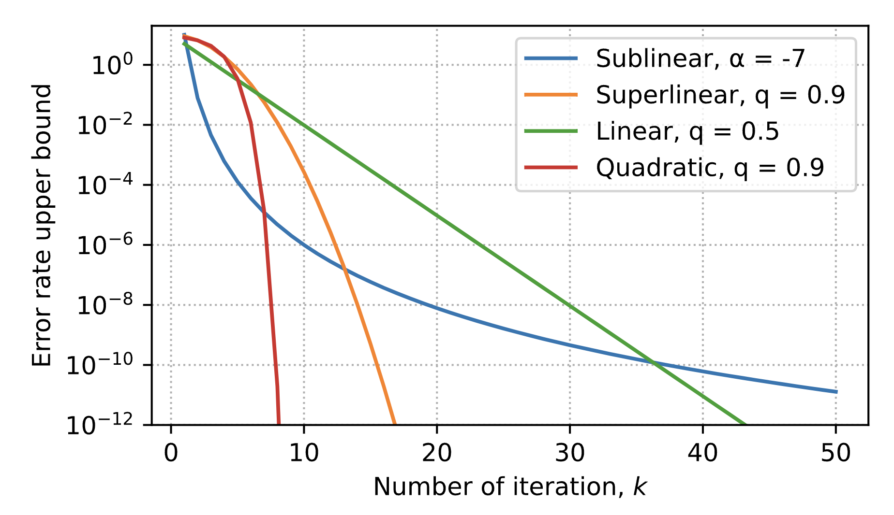

# Rate of Convergence

In numerical analysis and optimization, understanding the rate of convergence is crucial for evaluating the efficiency of algorithms. The rate of convergence describes how quickly a sequence approaches its limit. Here, we explore different types of convergence rates: linear, sublinear, superlinear, and quadratic.

**Linear Convergence**:

A sequence $\{x_k\}$ is said to converge linearly to $x^*$ if there exists a constant $0 < c < 1$ such that:

$$
\|x_{k+1} - x^*\| \leq c \|x_k - x^*\|
$$

Then we have $\|x_{k+1} - x^*\| = O(c^k)$.

Linear convergence implies that the error reduces by a constant factor in each iteration. This is typical for many first-order optimization methods, such as gradient descent with a fixed step size.

**Sublinear Convergence**:

Sublinear convergence occurs when the rate of convergence is slower than linear. A sequence $\{x_k\}$ converges sublinearly if:

$$
\lim_{k \to \infty} \frac{\|x_{k+1} - x^*\|}{\|x_k - x^*\|} = 1
$$

For example, $\|x_{k+1} - x^*\| = O(k^q)$ for $q < 0$.

Sublinear convergence is common in the first order optimization methods without strong convexity, such as gradient descent with diminishing step sizes.

**Superlinear Convergence**:

A sequence $\{x_k\}$ converges superlinearly to $x^*$ if:

$$
\lim_{k \to \infty} \frac{\|x_{k+1} - x^*\|}{\|x_k - x^*\|} = 0
$$

Then we have $\|x_{k+1} - x^*\| = O(q^{k^2})$, for some $q < 1$.

Superlinear convergence indicates that the sequence approaches the limit faster than any linear rate. This is often seen in methods like Newton's method when close to the solution.

**Quadratic Convergence**:

Quadratic convergence is a special case of superlinear convergence where the error term squares at each iteration. A sequence $\{x_k\}$ converges quadratically if:

$$
\|x_{k+1} - x^*\| \leq c \|x_k - x^*\|^2
$$

Then we have $\|x_{k+1} - x^*\| = O(q^{k^2})$, for some $q < 1$.

Quadratic convergence is highly desirable as it implies rapid convergence near the solution. Newton's method exhibits quadratic convergence under certain conditions.

