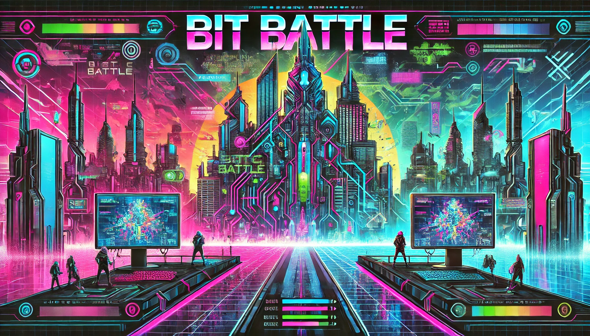

# Bit Battle

Welcome to the Bit Battle! 🎮 Where coding meets competition and bytes mean business! 

🎵 [Click here to play the Bit Battle Anthem](https://www.dropbox.com/scl/fi/949wt25ywgx5790z16ipn/BitBattle.mp3?rlkey=dvdcjbpf55lqtlrj26duc0yuh&dl=0)

## What's a Bit Battle? 

A Bit Battle is a thrilling competition where code squads compete to write the most efficient, precise, and elegant solutions to challenging problems. It will be specified in some homework. Think of it as the Olympics of coding, but with more caffeine and fewer physical injuries! 🏃‍♂️💻

## The $byte Economy 101

- Every squad starts with a shiny deposit of ₿100 bytes 💰
- This virtual currency can be used for... well, bragging rights mostly! 
- Squad can use the $byte to buy more late days. The current price is ₿5 = 1 hour. Notice that no matter how many late days you have earned, you have to submit all your homework before the last day of the semester.
- You can buy late days using your current $byte balance whenever you run up your late days. Please write at the head of your homework ReadME.md file in the format: XX late days used for this homework, and XX days remained. We use XX $byte to buy XX late days.

### Battle Rewards
For each Bit Battle challenge, squads will be rewarded based on their rank:

- 🥇 1st Place: ₿100 bytes
- 🥈 2nd Place: ₿80 bytes
- 🥉 3rd Place: ₿60 bytes
- 4th Place: ₿40 bytes
- 5th Place: ₿20 bytes
- 6th Place: ₿10 bytes
- 7th Place: ₿5 bytes

## Auction Rules

As the student number is not always divisible by 3, we will use an auction to determine which individual students can join a squad as the 4th member. 

**Eligibility**: We will announce the auction time, which will be in class. Any individual student who wishes to bid has to be in class physically at the time of the auction.

**Bidding Process**:
  - The auction will be conducted in a live auction format.
  - Bids will be publicly announced, and students can increase their bids in real-time.
  - Instructor will be the auctioneer deciding the winner following the [English auction rule](https://en.wikipedia.org/wiki/English_auction).
  - The starting price is - ₿500, and the minimum increment is ₿1.
  - Each interested student submits a bid indicating the number of bytes they are willing to spend to join a squad as the 4th member.

**Winning the Auction**:
  - The student with the highest bid wins.
  - If `NUM_of_Registered_Students % 3 == 2`, the second-highest bid will be the second winner.
  - The winning student(s) has the right to join a squad as the 4th member.
  - The winning student's bid amount will be deducted from the chosen squad's byte balance. Namely, the squad with the winner will have the initial byte balance = ₿100 - `Winner_Bid_Amount`.
  - Notice that as the starting price is negative, `Winner_Bid_Amount` could be negative, which means the squad has to earn more bytes in the later bit battle to buy late days.
  -  The `Winner_Bid_Amount` can be more than ₿100, which means squad initial balance can be negative, then the squad has to earn more bytes in the later bit battle to buy late days.

**Exception Rules**:
  - If no bidder accepts the starting price, the auctioneer will further decrease the starting price until the end of the auction time.
  - If still no bidder accepts the starting price, we will let students naturally form squads with members of 3 or 4.
  - If there are still students who are not in any squad, we will randomly assign them to a squad.

## Bit Battle Events

Watch out for each homework for bit battle events. We will specify which part of the homework is for bit battle and what is the metric to rank the squads.

## Final Notes

Remember: The real treasure was the algorithms we optimized along the way! 

May the bytes be ever in your favor! 🎮✨

As this is the first time we do this, we may adjust the rules based on the feedback. 

