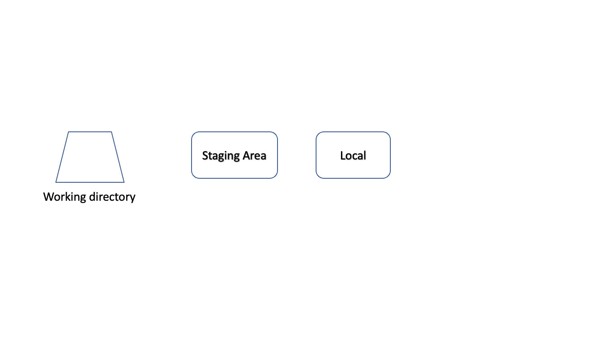
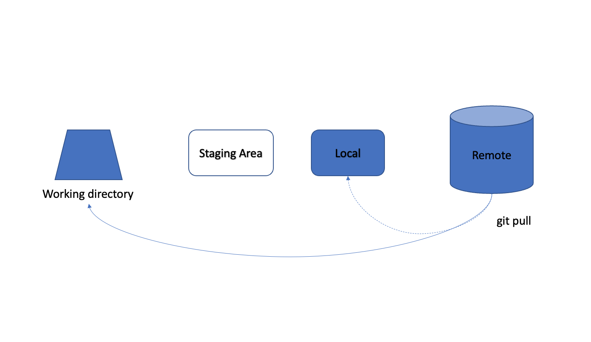
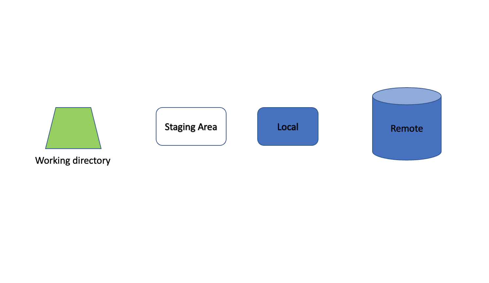
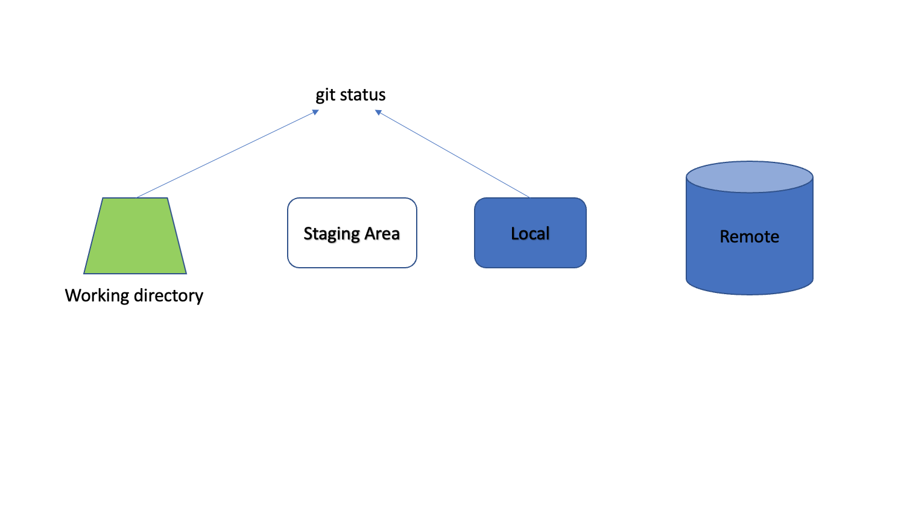
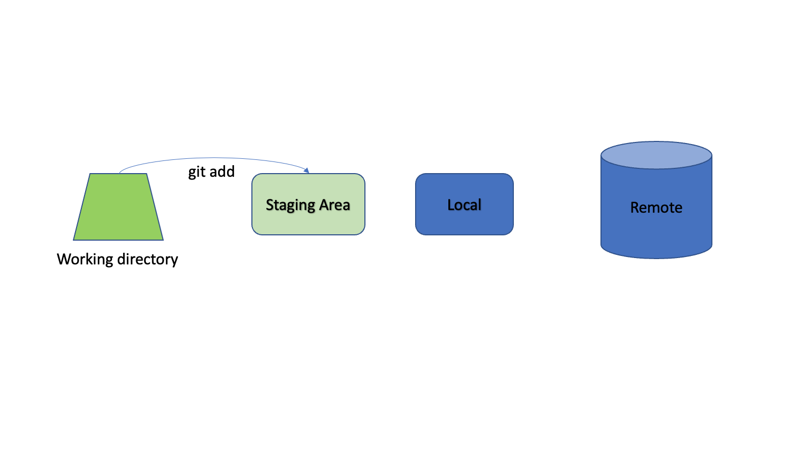
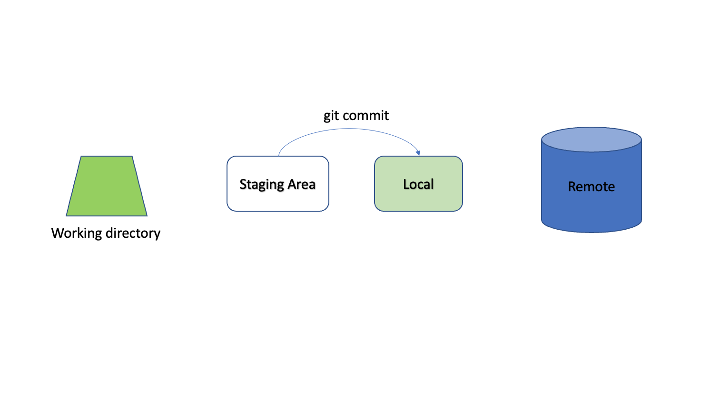
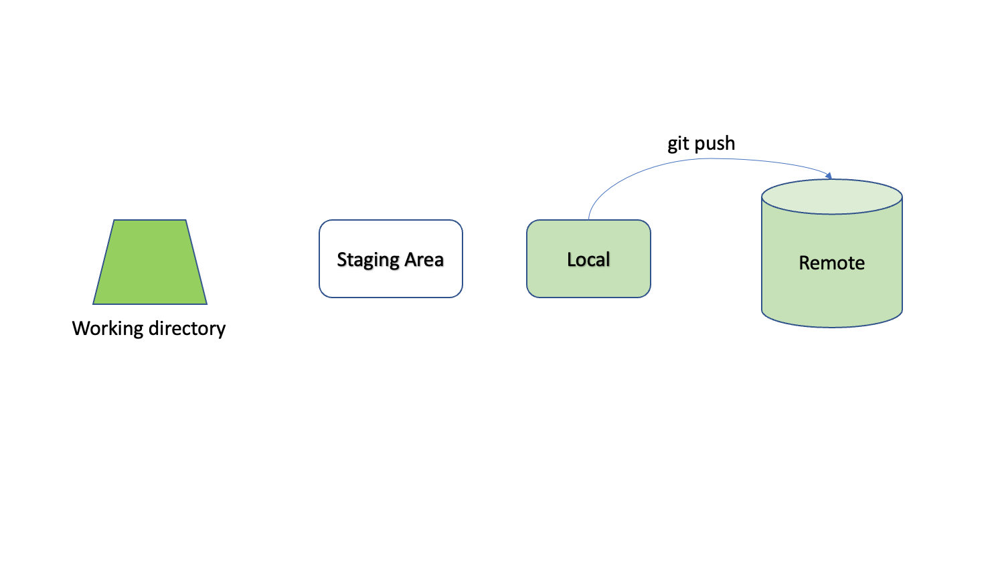
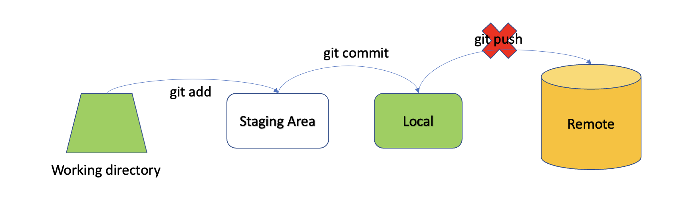

## First, let's talk about version control

Version control is essential for:

1. **Tracking Changes**: Keep a COMPLETE history of your project
2. **Collaboration**: Work effectively with others
3. **Backup and Reproducibility**: Go back to any previous state of your project
4. **Documentation**: Document changes and their reasons

## Let install Git


## Git Basics

If you are using VS Code, you can check the tutorial [here](https://code.visualstudio.com/docs/sourcecontrol/intro-to-git).

### Setting Up Git the first time

In order for Git to work with GitHub, it would need to know your GitHub account.<br>
First time setup:
```bash
git config --global user.name "Your GitHub Name"
git config --global user.email "your.email@example.com"
```
For example, my github account is githubnyu and its email is phucvu7139@gmail.com, so I run:
```bash
git config --global user.name "githubnyu"
git config --global user.email "phucvu7139@gmail.com"
```


### Setting up your credentials
In order for GitHub to trust your Git, you will also need to set up a key to let GitHub know that it is really you!

1. Create a GitHub account at [github.com](https://github.com)
2. Set up SSH keys for secure authentication:
    ```bash
    ssh-keygen -t ed25519 -C "your.email@example.com"
    ```
    Since my email is phucvu7139@gmail.com, I run
    ```bash
    ssh-keygen -t ed25519 -C "phucvu7139@gmail.com"
    ```
3. After this, it will ask you for a file to save the newly generated key, a pass phrase and repeat that passphrase. For simplicity, do not provide anything and just hit enter(return) three times. 
4. To view the key you just created, run:
    ```bash
    cat ~/.ssh/id_ed25519.pub
    ```
    This will print out the key you generated. Copy this!!
5. Now you would need to add this key to GitHub. Go to your GitHub page>>Click on the avatar(upper right)>>Settings>>SSH and GPG keys(on the left panel)>>New SSH key>>Give a title (exp: my computer)>>paste the key you copied to Key>>Add SSH Key

### GitHub Collaboration Workflow

You can follow the VS Code tutorial [here](https://code.visualstudio.com/docs/sourcecontrol/github) for the Github collaboration workflow on VS Code. We suggest the following workflow for contributing to public repositories. You may use [Make](make.md) to automate your workflow instead of memorizing all the commands.

Here are the visualization of the workflow on the commit status of the remote Github, local git, and local directory.
=== "<0>"
    To better follow these example, please first sign in to your GitHub account and go to this [example repository](https://github.com/githubnyu/example1618).<br>
    Then click Fork >> Create Fork<br>
    Remember that GitHub is a place to share your code. What you just did is basically copying my whole project and create a repository to store it in your account!
=== "<1>"
    To learn Git, you first have to let your computer know where you want to work!
    We use cd following the directory. Mine will be different from yours
    ```bash
    cd ~/Desktop
    mkdir example1618 
    cd ./example1618
    ```
    The first command change the working directory to be my Desktop.<br>
    The second commands creates a folder called example1618 in my current working directory (Desktop)<br>
    The last command changes the working directory to the newly created folder<br>
    
=== "<2>"
    Next, we create an "imaginary" local repository and staging area with
    ```bash
    git init
    ```
    By imaginary, I meant that this create a a hidden folder ".git" in your working directory. With this, you now can keep track of your project progress. Don't believe me, you can run 
    ```bash
    ls -a
    ```
    
=== "<3>"
    Next, we let our computer know which GitHub Repository is the one we want to work with.
    ```bash
    git remote add origin <your repo link>
    ```
    Your repo link can be found at: Your GitHub repo >> Code(Green button)>>SSH>>copy the link.
    Since my link is "git@github.com:phucvu-nyu/example1618.git", I run
    ```bash
    git remote add origin git@github.com:phucvu-nyu/example1618.git
    ```
    This command tell your computer to name this GitHub repo "origin". You don't have to but are highly encourage to name it origin since this is the default setting. From now on, origin is the GitHub repo in this working directory.
    
=== "<4>"
    Finally, let's "pull" everything in this remote repo to our working directory. For the purpose of understing git basics, you can ignore the first command for now. Basically, "git pull" copy the content of the main branch from the remote repo to your local working directory and updates these content to you local repo. Meaning, your working directory, your local repo, and your remote repo have the same information.
    ```bash
    git checkout -b main
    git pull origin main
    ```
    
    # For new version of git, you don't need the first command.
=== "<4.5>"
    Step 1 to 4 is so common that we have a quick command for this proces : git clone
    ```bash
    cd .. 
    rm -rf  example1618
    ```
    ```bash
    git clone <your repo link>
    ```
    ```bash
    cd ./example1618
    ```
    The first command set your working directory back to the parent of the current working directory.<br>
    The second command delete the folder example1618 in your current working directory <br>
    The third command = step 1-->4 <br>
    The last command set the working directory to the folder example1618 that is newly created from the git clone command
=== "<5>"
    Congratulation! You now can download the content of your GitHub to your computer. But whatif you want to make changes? Say fill out the README.md form, the fruit.txt file, and the first TWO questions in the animal.txt file. As you can see the content (color) of your working directory is no longer the same as your local repo and your remote repo!
    

=== "<6>"
    You first can view git status to see the high level differences between your working directory and your local repo. In addition, git diff provide a more detailed 
    ```bash
    git status
    ```
    

=== "<7>"
    After seeing the changes you made, you can now choose what changes to add to the staging area. For example, I added my changes in the README.md and the fruit.txt but still need more time to work on my animal.txt file.
    ```bash
    git add README.md
    git add fruit.txt
    git add animal.txt
    ```
    But wait! The animal.txt needs more work, so maybe we should not add this to the staging area now! You can use git reset to undo git add.
    ```bash
    git reset animal.txt
    ```
    

=== "<8>"
    Once you finished with your staging area. You can commit these changes to your local repo.<br>
    Always leave a detailed comment as this will save you a lot of time looking back later!
    ```bash
    git commit -m"Filling out README.md and answer fruit.txt"
    ```
    

=== "<9>"
    Now you are ready to push the changes from your local repo to your remote repo with git push
    ```bash
    git push origin main
    ```
    

=== "<10>"
    Finally, use can you git log to view your commit history.
    ```bash
    git log
    ```
    Hit q to escape the log setup<br>
    If we stop here, you should be able to use Git and GitHub as a personal storage and distributor of your code. And for a student, this should be how you mainly use it.
=== "<11>"
    However, in real life, you tend to have collaborators. And more often than not, some time they made changes without your knowledge:
    Let's say remotely I go to GitHub and answer some questions in animal.txt intentionally wrong
    Locally, I add and commit the change I made on the animal.txt.
    ```bash
    git add animal.txt
    git commit -m"answer a few thing in animal.txt"
    ```
    In this case, if you push, there will be error!
    Don't believe me, try!
    ```bash
    git push origin main
    ```
    
    Previously, remote repo is different from local repo but we can still push. Why can't we now??

=== "<12>"
    To understand the problem, first we have to understand how git performs version control. It create a history of state of your project with each commits.
    Example:
    ```bash
    A---B---C--D--E (remote repo main)
    ```

    Previously:
    ```bash
    A---B---C (remote repo main)           A---B---C--D--E (remote repo main)
                                 -->
    A---B---C---D---E (your local repo main)
    ```
    Now:
    ```bash
    A---B---C --F --G (remote repo main)            A---B---C--D--E (remote repo main)
                                          --> ????
     A---B---C---D---E (your local repo main)       A---B---C--F--G (remote repo main)
    ```
    In this case, if you push, git will be confused since it does not know which changes to update to remote repo.

=== "<13>"
    Please don't try to run the code in this section:<br>
    There are three direct options (that I know) that you can do from here:<br>
    **Option 1: force push**
    ```bash
    git push -f origin main
    ```
    ```bash
    A---B---C --F --G (remote repo main)        
                                    -->       A---B---C--D--E (remote repo main)
    A---B---C --D---E (your local repo main)       
    ```
    This OVERWRITES the remote repository with your local changes, discarding commits F and G completely. This is dangerous since we no longer have record of F and G<br>
    **Option 2: rebase (recommend)**
    ```bash
    git fetch origin main # let your local knows about the updates in remote main
    git rebase # add those updates to the history,then add the changes you made
    git push
    ```
    ```bash
    A---B---C---F---G (remote repo main)        
                                 -->       A---B---C--F--G--D'--E' (remote repo main)
    A---B---C---D---E (your local repo main)       
    ```
    This takes your local changes (D and E) and applies them after the latest remote changes (F and G), creating new commits (D' and E'). This is recommended since we still keep a record fo F and G while successfully implement our changes.<br>
    **Option 3: fetch and merge (pull)**
    ```bash
    git fetch origin main
    git merge origin/main # merge these updates with your current versions
    git push
    ```
    ```bash
    A---B---C --F --G (remote repo main)    A---B---C---F---G--- H  (remote repo main) 
                                 -->                 \       /
    A---B---C -- D---E (your local repo main)          D---E
    ```
    This creates a merge commit (H) that combines both histories. This option gives the best depiction of the history but it is also messy.
=== "<14>"
    This is all cool and great! But what if I want to work on separate task and without constant worrying about all these conflicts?<br>
    Another way to work around these conflict is to create a branch at the beginning of working on your task<br>
    What is a branch then?<br>
    A branch is like a parallel universe for your project where you can make changes that don't affect the main project.
    ```bash
       A---B---C---F---G (remote repo main)       
                \                                   
                 D---E (remote repo newbranch)  
                                                --> A---B---C---D---E--H--J (remote repo newbranch)  
       A---B---C---F---G (local repo main)       
                \                                   
                 D---E---H---J (local repo newbranch)         
    ```
    
=== "<15>"
    There are two ways you can create a branch <br>
    1. **Create directly on GitHub**<br>
    Your repository>>Branch>>New branch>>name your new branch>>Create new branch<br>
    Then pull, work, and push to it!
    ```bash
    git checkout -b newbranch
    git pull origin newbranch
    git add <filename>
    git commit -m"comment"
    git push origin newbranch
    ```
    2. **Create locally using Git commands then push to GitHub**
    ```bash
    git checkout -b newbranch2
    # edit animal.txt
    git add animal.txt
    git commit -m"adding answers to animal.txt"
    git push origin newbranch2
    ```
=== "<16>"
    When you are done with your task, you can create a pull request that merges your branch into the main branch.
    <br>
    1. Go to your GitHub repository
    2. Click on "Pull requests" tab
    3. Click the "New pull request" button
    4. Select your branch to compare with main
    5. Click "Create pull request"
    6. Add a title and description explaining your changes
    7. Click "Create pull request" again
    <br>
    <br>
    After creating the pull request: <br>
    - Team members can review your code<br>
    - Discussions can happen in comments<br>
    - Additional commits can be added to the PR<br>
    - When approved, the branch can be merged<br>
    <br>
    After merging:<br>
    - Your changes are now in the main branch<br>
    - You can delete the feature branch<br>
    - Everyone can pull the updated main branch<br>


<br>
<br>
<br>
<br>
<br>
<br>
<br>
<br>
<br>
<br>
<br>
<br>
<br>
<br>
<br>
<br>
## Advanced Git Usage

### Resolving Merge Conflicts

We recommend using VS Code to resolve conflicts. Here is the tutorial [here](https://code.visualstudio.com/docs/editor/versioncontrol#_merge-conflicts). You can also watch this [video tutorial](https://www.youtube.com/watch?v=lz5OuKzvadQ).


### .gitignore

Create a `.gitignore` file to exclude:

- Large data files
- Sensitive information
- Generated files
- System files

Example `.gitignore`:
```plaintext
# Data files
*.csv
*.xlsx
data/

# Generated files
*.pdf
results/

# System files
.DS_Store
.Rhistory
```


