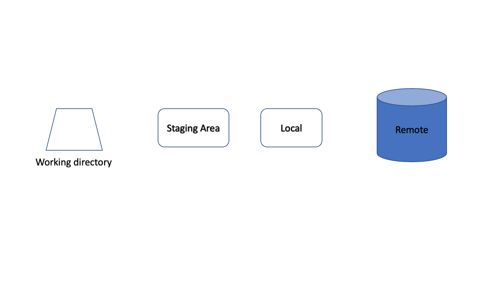

## First, let's talk about version control

Version control is essential for:

1. **Tracking Changes**: Keep a COMPLETE history of your project
2. **Collaboration**: Work effectively with others
3. **Backup and Reproducibility**: Go back to any previous state of your project
4. **Documentation**: Document changes and their reasons

## Let install Git


## Git Basics

If you are using VS Code, you can check the tutorial [here](https://code.visualstudio.com/docs/sourcecontrol/intro-to-git).

### Setting Up Git

First time setup:
```bash
git config --global user.name "Your GitHub Name"
git config --global user.email "your.email@example.com"
```
For example, my github account is githubnyu and its email is phucvu7139@gmail.com, so I run:
```bash
git config --global user.name "githubnyu"
git config --global user.email "phucvu7139@gmail.com"
```
Initialize a repository only when you create a project
```bash
git init 
```


### Basic Git Workflow


1. **Check Status**
```bash
git status
```

3. **Stage Changes**
```bash
git add filename     # Stage specific file
git add .           # Stage all changes
```

4. **Commit Changes**
```bash

git commit -m "Descriptive message about changes"
```

5. **View History**
```bash
git log             # View commit history
git diff            # View unstaged changes
```

### Best Practices for Commits

1. **Commit Often**: Make small, logical commits
2. **Write Clear Messages**: Use descriptive commit messages
      ```bash
      # Bad commit message
      git commit -m "Update"
      # Good commit message
      git commit -m "Add bootstrap confidence intervals to regression analysis"
      ```

Different tasks have different best practice for the git. For example, software engineering tasks may prefer to group related changes into one commit and want to test before committing. To avoid half-done work, you can use `git commit --amend --no-edit` to quickly add forgotten changes to your last commit, but only if you haven't shared that commit with others. As a git beginner, we suggest that you focus on the two points above and gradually explore the best git practice for you.

## GitHub

You can read the [Github official documentation](https://docs.github.com/en/get-started/using-github/github-flow) for the suggested workflow for using GitHub for collaboration. 
There are tools like [Github Desktop](https://desktop.github.com/) and [VS Code Github](https://code.visualstudio.com/docs/sourcecontrol/github) that can help you manage your repositories more conveniently. You can also create your own workflows using tools like [GNU Make](make.md) with [GitHub command-line tool `gh`](https://cli.github.com/).

!!! tip "GitHub beyond repository"

    GitHub is not just a place to host your code. It is also a social network for developers. You can follow others, see what they are working on, star their repositories, and collaborate with them.

    GitHub is also your resume, it will help you get a job. Imagine the employer goes to your GitHub and sees all the 1k-star projects you have worked on.

### Setting Up GitHub

1. Create a GitHub account at [github.com](https://github.com)
2. Set up SSH keys for secure authentication:
    ```bash
    ssh-keygen -t ed25519 -C "your.email@example.com"
    ```
3. [Add the public key to your GitHub account](https://docs.github.com/en/authentication/connecting-to-github-with-ssh/adding-a-new-ssh-key-to-your-github-account)
4. (Optional) Install [GitHub gh](https://cli.github.com/)
    ```bash
    brew install gh # MacOS
    ```

### GitHub Collaboration Workflow

You can follow the VS Code tutorial [here](https://code.visualstudio.com/docs/sourcecontrol/github) for the Github collaboration workflow on VS Code. We suggest the following workflow for contributing to public repositories. You may use [Make](make.md) to automate your workflow instead of memorizing all the commands.

Here are the visualization of the workflow on the commit status of the remote Github, local git, and local disk. You can cross reference to the text instructions below for better understanding. Note that we add a fork step if you want to contribute to a public repository, which you do not have the permission to push to. You can follow the simplified instructions in the figures below if you can access the original repository.
=== "<1>"
    First, you have to let your computer know where you want to work!
    We use cd following the directory. Mine will be different from yours
    ```bash
    cd ~/Desktop
    mkdir example1618 
    cd ./example1618
    ```
    The first command change the working directory to be my Desktop.<br>
    The second commands creates a folder called example1618 in my current working directory (Desktop)<br>
    The last command changes the working directory to the newly created folder<br>
    
=== "<2>"
    Next, we create an "imaginary" local repository and staging area with
    ```bash
    git init
    ```
    By imaginary, I meant that this create a a hidden folder ".git" in your working directory. With this, you now can keep track of your project progress. Don't believe me, you can run 
    ```bash
    ls -a
    ```
    
=== "<3>"
    Next, we let our computer know which GitHub Repository is the one we want to work with.
    ```bash
    git remote add origin <your repo link>
    ```
    Your repo link can be found at: Your GitHub repo >> Code(Green button)>>SSH>>copy the link.
    Since my link is "git@github.com:phucvu-nyu/testy.git", I run
    ```bash
    git remote add origin git@github.com:phucvu-nyu/testy.git
    ```
    This command tell your computer to name this GitHub repo "origin". You don't have to but are highly encourage to name it origin since this is the default setting. From now on, origin is the GitHub repo in this working directory.
    
=== "<4>"
    Finally, let's "pull" everything in this remote repo to our working directory. For the purpose of understing git basics, you can ignore the first command for now. Basically, "git pull" copy the content of the main branch from the remote repo to your local working directory and updates these content to you local repo. Meaning, your working directory, your local repo, and your remote repo have the same information.
    ```bash
    git checkout -b main
    git pull origin main
    ```
    
    # For new version of git, you don't need the first command.
=== "<5>"
    Congratulation! You now can download the content of your GitHub to your computer. But whatif you want to make changes? Say fill out the README.md form? As you can see the content (color) of your working directory is no longer the same as your local repo and your remote repo!
    

=== "<6>"
    You first can view git status to see what are the differences between your working directory and your local repo
    ```bash
    git status
    ```
    

=== "<7>"
    After seeing the changes you made, you can now choose what changes to add to the staging area. For example, I added my changes in the README.md file and the fruit.txt file but still need more time to work on my animal.txt file.
    ```bash
    git add README.md
    git add fruit.txt
    ```
    

=== "<8>"
    Once you finished with your staging area. You can commit these changes to your local repo.<br>
    Always leave a detailed comment as this will save you a lot of time looking back later!
    ```bash
    git commit -m"Filling out README.md and modified fruit.txt"
    ```
    

=== "<9>"
    Now you are ready to push the changes from your local repo to your remote repo with git push
    ```bash
    git push origin main
    ```
    

=== "<10>"
    

=== "<11>"
    

=== "<12>"
    

=== "<13>"
    

=== "<14>"
    

=== "<15>"
    

=== "<16>"
    

**Initial Repository Setup and Branch Creation**

1. **Fork the Repository**
      - Go to the original repository on GitHub
      - Click the "Fork" button in the top-right corner to create your own copy
      - This creates a copy of the repository under your GitHub account

2. **Clone Your Forked Repository**
      - Clone your fork (not the original repository)
      ```bash
      git clone git@github.com:YOUR_USERNAME/REPOSITORY_NAME.git
      cd REPOSITORY_NAME
      ```

3. **Add Original Repository as Remote**
      - Add the original repository as a remote called "upstream"
      ```bash
      git remote add upstream https://github.com/ORIGINAL_OWNER/REPOSITORY_NAME.git
      ```
      - You now have two remotes:
        - `origin`: your fork
        - `upstream`: original repository

4. **Create a New Working Branch**
      - Every new feature should be developed in a new branch
      - Execute `git checkout -b my_feature` to create and switch to a new branch
      - This effectively creates a local copy on a separate branch

**Code Development and Local Changes**


3. **Modify Local Code**
      - Make necessary changes to source files

4. **Review Code Changes**
      - Use `git diff` to inspect modifications

5. **Commit Local Changes**
      - Use `git commit -a -m "Descriptive message about changes"`

6. **Push Branch to Your Fork**
      - Execute `git push -f origin my_feature`

**Handling Remote Repository Updates**

1. **Switch to Main Branch**
      - Use `git checkout main` to return to the primary branch
      - **Warning**: Commit your branch before switching to main branch, or you will lose all your changes.

2. **Pull Latest Changes**
      - Execute `git pull upstream main` to update local repository with remote modifications

3. **Return to Working Branch**
      - Switch back to my_feature branch using `git checkout my_feature`

4. **Rebase Working Branch**
      - Use `git rebase main` to integrate main branch updates into your working branch
      - Note: Potential merge conflicts may require manual code selection
      - Understand the difference between git pull and git rebase [here](https://www.atlassian.com/git/tutorials/merging-vs-rebasing)

5. **Force Push Updated Branch**
      - Execute `git push -f origin my_feature` to update remote repository with rebased changes

**Creating Pull Request**

1. **Create Pull Request**
      - Go to the original repository on GitHub, click "Pull Requests"
      - Click "New Pull Request"
      - Choose "compare across forks"
      - Select your fork and feature branch
      - Fill in the PR description and submit

2. **Merge Request**
      - Project owner can use "squash and merge" in Github pull request to consolidate commits
      - Checkout how "squash and merge" works [here](https://docs.github.com/en/pull-requests/collaborating-with-pull-requests/incorporating-changes-from-a-pull-request/about-pull-request-merges)


!!! tip "Tip: Always rebase"
    - Always rebase your branch on the main branch before creating a pull request.
    - This will make your pull request history cleaner and easier to review.
    - You can simply use `git pull origin my_feature --rebase` to rebase your branch on the github main branch.


## Advanced Git Usage

### Resolving Merge Conflicts

We recommend using VS Code to resolve conflicts. Here is the tutorial [here](https://code.visualstudio.com/docs/editor/versioncontrol#_merge-conflicts). You can also watch this [video tutorial](https://www.youtube.com/watch?v=lz5OuKzvadQ).


### .gitignore

Create a `.gitignore` file to exclude:

- Large data files
- Sensitive information
- Generated files
- System files

Example `.gitignore`:
```plaintext
# Data files
*.csv
*.xlsx
data/

# Generated files
*.pdf
results/

# System files
.DS_Store
.Rhistory
```


