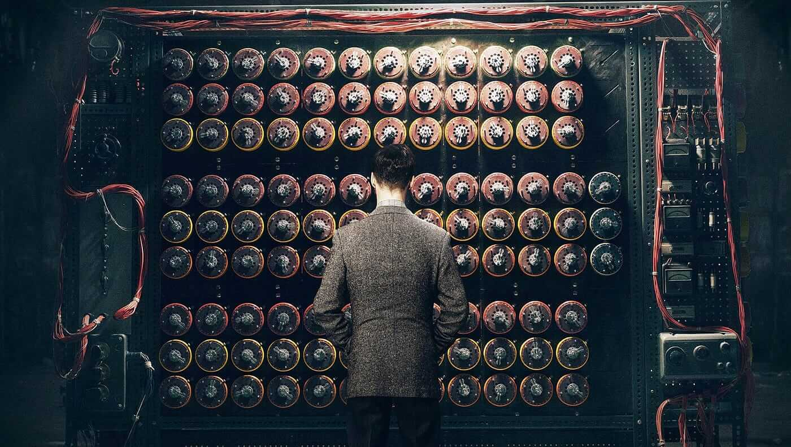

# BST 236 Computing I

Welcome to BST236! I am excited to welcome you. This course is designed to prepare you for all what you need for the basic computational skills for data science. The way of coding in the era of generative AI has been revolutionized. 
I aim to teach you all aspects of statistical computing seamlessly integrated with AI copilot. You will not only learn various cool algorithms but also the workflow of efficient and reproducible programming. Let's dive into an exciting semester of learning and discovery!

[Dive in](chapter_syllabus/)
